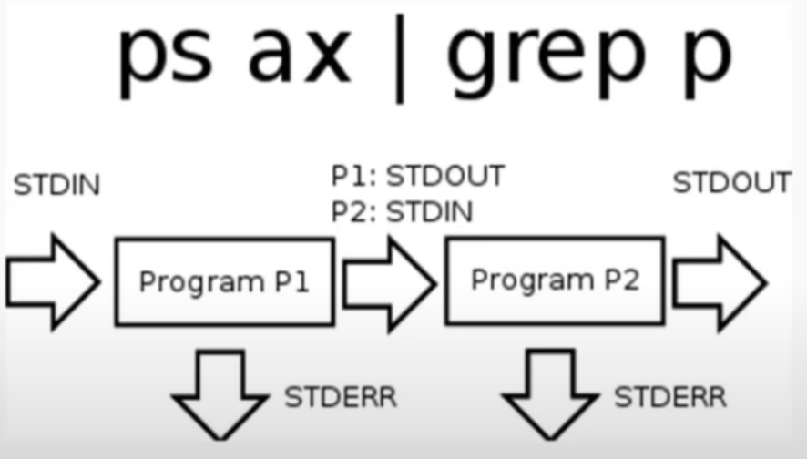

#[Лекция 2. Терминология. Средства удаленного доступа. Вход в систему](https://www.youtube.com/watch?v=cbo0HVW2ydw)

`1:50`: Терминология

- User
- Login
- Консоль/Терминал/Shell:
    - Консоль (console) и терминал (terminal) - средства IO (клавиатура/монитор, устройства com-порта типа модема)
    - Shell - командный интерпретатор. Командная срока
    
ААА:
- Authentification. Проверка подлинности пары user:password ()
- Authorization. Предоставление прав доступа - например членство в группе (предполетная проверка)
- Accounting. Сохранение информации о деятельности пользователя. (пассажир доставлени из А в Б)

### `26:10`: Организация файловой системы Linux
- Иерархическая
- Структурирована
    - /etc - локальные настройки
    - /home - каталоги
    - /bin (**/bin) - базовые утилиты: cp, mv ... (такие, которые нужны для того, чтобы загрузить систему)
    - /sbin (**/sbin) - service bin - сервисные утилиты (обычно только для системы, суперюзера, настройки и обслуживания системы)
        - не всегда есть в PATH. В разных дистрибутивах у обычного юзера нет прямого доступа туда
    - /usr - общая часть программ.
        - обычно примонтирован в режиме чтения
    - /var - изменяемые файлы (логи, очереди, базы, кэши)
    
### `30:00`: Осмотреться. Что вокруг
Полезные команды:

`uname`:
- `-a`: Behave as though all of the options -mnrsv were specified.
```
Mac:
Darwin alex-iMac.local 19.6.0 Darwin Kernel Version 19.6.0: Mon Apr 12 20:57:45 PDT 2021; root:xnu-6153.141.28.1~1/RELEASE_X86_64 x86_64

Linux:
Linux alex-kde 5.4.0-74-generic #83-Ubuntu SMP Sat May 8 02:35:39 UTC 2021 x86_64 x86_64 x86_64 GNU/Linux
```
- `-m`: print the machine hardware name.
```
Mac:
x86_64

Linux:
x86_64
```
- -p : print the machine processor architecture name.
```
Mac:
i386

Linux:
x86_64
```
`df`:

- `-h`: human-readable df (disk free):
```
alex-iMac:~ alex$ df -h

Filesystem                                    Size   Used  Avail Capacity    iused      ifree %iused  Mounted on
/dev/disk1s5                                 562Gi   10Gi   88Gi    11%     488281 5888183719    0%   /
devfs                                        198Ki  198Ki    0Bi   100%        684          0  100%   /dev
/dev/disk1s1                                 562Gi  449Gi   88Gi    84%    2520590 5886151410    0%   /System/Volumes/Data
/dev/disk1s4                                 562Gi   14Gi   88Gi    14%          8 5888671992    0%   /private/var/vm
map auto_home                                  0Bi    0Bi    0Bi   100%          0          0  100%   /System/Volumes/Data/home
/dev/disk0s3                                 370Gi  259Gi  111Gi    70%    1441167  116699957    1%   /Volumes/BOOTCAMP
//alex@AL._afpovertcp._tcp.local/BackUp_Mac   14Ti  6.1Ti  7.9Ti    44% 1630123271 2115985410   44%   /Volumes/.timemachine/AL._afpovertcp._tcp.local/0EB0974E-393A-45E5-B23C-842AC88D0221/BackUp_Mac
/dev/disk2s2                                  13Ti  5.4Ti  7.9Ti    41%    7766112 4287201167    0%   /Volumes/Time Machine Backups
/dev/disk1s3                                 562Gi  505Mi   88Gi     1%         54 5888671946    0%   /Volumes/Recovery

Linux

Filesystem      Size  Used Avail Use% Mounted on
udev            5,8G     0  5,8G   0% /dev
tmpfs           1,2G  1,6M  1,2G   1% /run
/dev/sda5       114G   77G   32G  72% /
tmpfs           5,8G     0  5,8G   0% /dev/shm
tmpfs           5,0M  4,0K  5,0M   1% /run/lock
tmpfs           5,8G     0  5,8G   0% /sys/fs/cgroup
tmpfs           5,8G  296M  5,6G   5% /tmp
```
- `-i`: Информация об inode:
    - обычно под inode'ы выделяется около 1% дискового пространства
    - иноды распределя.тся при создании файловой системы
    - возможна ситуация, когда выводится ошибка "No space left on device", но при этом `df -h` показывает наличие свободного места. `df -i` может показать исчерпание инодов
```
Linux

Filesystem         Inodes  IUsed      IFree IUse% Mounted on
udev              1506896    576    1506320    1% /dev
tmpfs             1518518   1068    1517450    1% /run
/dev/sda5         7618560 920010    6698550   13% /
tmpfs             1518518      1    1518517    1% /dev/shm
tmpfs             1518518      4    1518514    1% /run/lock
tmpfs             1518518     18    1518500    1% /sys/fs/cgroup
tmpfs             1518518     39    1518479    1% /tmp
```

ЗЫ: Tmpfs — временное файловое хранилище во многих Unix-подобных ОС. Предназначена для монтирования файловой системы, но размещается в ОЗУ вместо физического диска.

`stat file`:
```
Mac:
16777221 12887339088 drwxr-xr-x 13 Joeyke staff 0 416 "Jun 10 22:25:19 2021" "Jun 10 22:25:14 2021" "Jun 10 22:25:14 2021" "May 27 02:12:31 2020" 4096 0 0 IdeaProjects/

Linux:
  File: IdeaProjects/
  Size: 4096            Blocks: 8          IO Block: 4096   directory
Device: 805h/2053d      Inode: 4238612     Links: 4
Access: (0775/drwxrwxr-x)  Uid: ( 1000/    alex)   Gid: ( 1000/    alex)
Access: 2021-06-02 14:26:53.365408084 +0300
Modify: 2021-06-07 14:22:14.859971523 +0300
Change: 2021-06-07 14:22:14.859971523 +0300
 Birth: -
```
При этом Links - это только жесткие ссылки.

Жесткие ссылки работают только внутри одного тома, в отличие от мягких

`free`: покатывает информацию об использовании памяти и swap
- shared - разделяемая между приложениями
- buffer - не записанные на физические носители блоки данных, которые отданы дисковой подсистеме для записи
- cashed - часто используемая информация
```
Linux:

total          used        free      shared  buff/cache   available
Mem:       12148148     2073396     5019020      628516     5055732     9126392
Swap:             0           0           0

На маке не было такой утилиты
```
`ps`: вывод процессов текущей сессии

### Пайпы



### Перенаправление потоков

- `> file` - перезаписать файлы 
- `>> file` - добавить в файл

#TODO: добавить пример с проекта с демонизацией скрипта

### Специальные файлы

- `/dev/null`: черная дыра
- `/dev/zero`: источник нулей
  - можно использовать с `dd` и проверять скорость записи на диск
- `/dev/random` и `/dev/urandom` - источники случайных данных

### Полезные программы

- `tee`: дублирует данные полученные через `stdin` в файл и `stdout`
- `which program`: покажет по какому пути будет расположен исполняемый файл `program`, который будет выполняться при запуске `program`

Пример: посмотреть где лежит jdk или python:
```
alex-iMac:~ alex$ which java
/usr/bin/java

alex-iMac:~ alex$ which python3
/Library/Frameworks/Python.framework/Versions/3.8/bin/python3
```

### `1:23:24`: Полезные вещи про background

Нужно когда нет возможности создать вторую сессию (работаем с одним экраном шелла)


### `1:27:30`: Как найти файл

- `ls -l | grep`
- `find`:
  - `-name`: фильтр по имени/маске
  - `-type`: указать тип объекта (d - директория, f - файл)
  - `-mtime`: фильтр по времени (-2 : моложе двух дней)
  - `-ls`: вывод информации с стиле ls -l
  - `-exec command {} \ `: для каждого найденного файла выполнить команду
  


- `locate`: очень быстро ищет, потому что использует index

### `1:35:45`: Как можно посмотреть содержимое файлов

more/less - программы-пейджеры (от сл. page)

- `cat` 
- `cat | less/more`
- `less`
- `more`

### `1:37:38`: Редактирование файлов

- `vi`: редактор, который есть в любой поставке
  - Режимы: вставка и командный
      - i - insert (режим вставки)
      - a - append (тоже режим вставки, но курсор после текущего символа)
  - `<esc>`: выйти из режима вставки
  - `^, $`: начало и конец строки
  - `dw/d6/d$/dd`: удалить слово/6 символов/все до конца строки/всю строку
  - `yy`: копировать строку
  - `p`: вставить строку
  - `x`, `wq`: выйти с сохранением

- `sed` (Stream EDitor) : редактирование потока
  
- `cat > file`
  - Вводим текст
  - Ctrl D (EOF)
  
- `touch file`: Создает пустой файл
  - Такой файл может использоваться как флаг. Нам важно только его наличие
  - Тач изменяет время модификации без изменения 
  
### `1:43:30`: Создание каталога

- `mkdir`: MaKe DIRectory:
- `-v`: подробный вывод
- `-p`: создает все эелементы пути

### `1:48:00`: Скопировать файл или каталог

- `cp`:
- `-v`: Подробный вывод
- `r`: Копировать каталоги рекурсивно
- `-p`: Сохранять разрешения

### `1:48:50`: Навигация по каталогам


- `cd -`: перемещение в предыдущий каталог

### `1:51:58`: Полезности длы shell

- Shell expansion:
  - `*` - формирует маски имен, позволяет посмотреть все файлы в каталоге без ls (echo *)
  - `{1..10}`
  
- Циклы в bash:
  - `for f in a b c; do echo f; done`
  - `while true; do echo 1; sleep .1; done`
  
- Alias

- Функции

- .bash_profile


