# Вопросы к экзамену МиСПИ 20/21

## 1. ISO/IEC 12207:2010: Жизненный цикл ПО. Группы процессов ЖЦ.

стр. 7

Жизненный цикл – время существования программы от момента замысла, 
до вывода ее из эксплуатации. Все этапы ЖЦ описаны в ISO 

Основные этапы:
- Разработка требований (формулирует заказчик)
- Анализ
- Проектирование
- Разработка и Тестирование
- Внедрение
- Эксплуатация (В процессе эксплуатации происходит поддержка пользователей)
- Вывод из эксплуатации

Группы процессов:
- Согласования (2)
- Орг. обоснования (5)
- Проектов (7)
- Тех. процессов (11)
- Реализация ПС (7)
- Поддержки ПС (8)
- Повторного использования ПС (3)

стр. 8

[wiki](https://ru.wikipedia.org/wiki/ISO/IEC_12207:2008)

## 2. Модели ЖЦ.

стр. 10


## 3. Водопадная (каскадная) модель.

стр. 12


Разработана в 60-х. Критически описана Ройсом в 70-х.

Каскадная модель определяет последовательный переход 
на следующий этап после завершения предыдущего. 
Для этой модели характерна автоматизация отдельных 
несвязанных задач. 

|Достоинства|Недостатки|
|:---|:---|
|Хорошие показатели по срокам разработки и надежности при решении отдельных задач| Неприменимость к большим и сложным проектам из-за невозможности принять изменения требований к системе в течение длительного проектирования|
| | Позднее тестирование|


## 4. Методология Ройса.

стр. 13

**Первый шаг**: 'Дизайн программы’. В нем дизайнеру предлагается спроектировать, определить и создать модели обработки данных и разработать документ: обзор будущей программы  

**Второй шаг**: документирование дизайна, требования к системе, спецификация дизайна, план тестирования, инструкция по использованию.

**Третий шаг**: 'do it twice', тестовая разработка параллельно основному процесса и использование в качестве пилота для подтверждения или опровержения основных спецификаций ПО

**Четвертый шаг**: планирование контроль и мониторинг 

**Пятый шаг**: подключения пользователя на ранних этапах

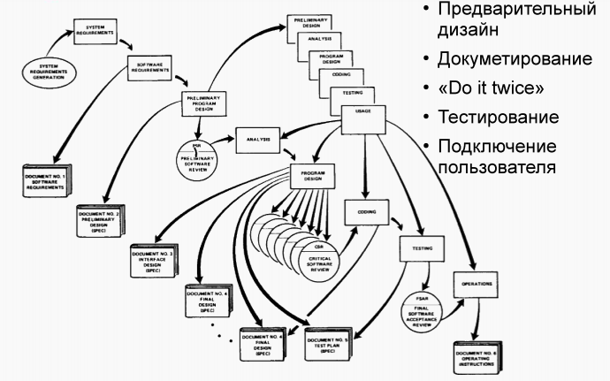

| Достоинства | Недостатки |
|:---|:---|
| Тестовая разработка параллельно основному процессу | |
| Подключение пользователей | |

## 5. Традиционная V-chart model J.Munson, B.Boehm.

стр. 14

Та же последовательность действий, что и в каскадной модели, 
но каждому уровню разработки свой уровень тестирования.

Модульное, интеграционное и системное тестирование проводятся 
последовательно на основании критериев верификации. Последним 
этапом является приемочное тестирование. Статическое тестирование 
может выполняться на ранней стадии разработки


|Достоинства|Недостатки|
|:---|:---|
| Тестирование ПО на каждой стадии ||

## 6. Многопроходная модель (Incremental model).

стр. 15

Цикл разделен на более мелкие легко создаваемые модули. Каждый модуль 
проходит через фазы определения требований, проектирования, кодирования, 
внедрения и тестирования. 

Процедура разработки по инкрементной модели предполагает выпуск на первом большом 
этапе продукта в базовой функциональности, а затем уже последовательное 
добавление новых функций, так называемых «инкрементов».

Процесс продолжается до тех пор, пока не будет создана полная система. 
Заказчик может наблюдать за разработкой, вносить изменения, 
которые не сильно увеличат стоимость.


|Достоинства|Недостатки|
|:---|:---|
| Изменения заказчика не намного увеличивают стоимость разработки. Модель закладывает не сложную доработку системы| Устаревание архитектуры системы |

## 7. Модель прототипирования (80-е).

стр. 16

Модель позволяет создать прототип программного продукта до или в течение 
этапа составления требований к программному продукту. 

Потенциальные пользователи работают с этим прототипом, определяя его сильные 
и слабые стороны, о результатах сообщают разработчикам программного продукта. 

Если прототип не подходит, то разработка начинается заново. 

Таким образом, обеспечивается обратная связь между 
пользователями и разработчиками, которая используется для изменения или корректировки спецификации требований к программному продукту


Жизненный цикл разработки программного продукта начинается с **разработки плана проекта**, 
затем выполняется **быстрый анализ**, после чего **создаются база данных**, 
**пользовательский интерфейс** и выполняется **разработка необходимых функций**. 

В результате этой работы получается документ, содержащий частичную 
спецификацию требований к программному продукту. После этого определяются 
проблемы, над устранением которых совместно работают пользователи и 
разработчики. Этот процесс продолжается, пока пользователи не станут довольны.


|Достоинства|Недостатки|
|:---|:---|
| Быстрая обратная связь ||
| Программный продукт точнее отвечает запросам пользователей ||

## 8. RAD методология. 80-е

стр. 18

**R**apid **A**pplication **D**evelopment model или быстрая разработка приложений

Разновидность _инкрементной модели_. Пользователь принимает 
непосредственное участие в процессе разработки.

При помощи интерфейса, пользователь способен создавать простейшие функции. 
В RAD-модели компоненты или функции разрабатываются несколькими 
высококвалифицированными командами параллельно, будто несколько мини-проектов.

Временные рамки одного цикла жестко **ограничены**.

Созданные модули затем интегрируются в один рабочий прототип. 
Синергия позволяет очень быстро предоставить клиенту для обозрения 
что-то рабочее с целью получения обратной связи и внесения изменений.


Модель быстрой разработки приложений включает следующие фазы:
- Бизнес-моделирование
- Моделирование данных
- Моделирование процесса
- Сборка приложения
- Тестирование

|Достоинства|Недостатки|
|:---|:---|
| Обратная связь от пользователей ||
| ||

## 9. Спиральная модель.

стр. 17

Спиральная модель = проектирование + постадийное прототипирование 

с целью сочетания преимуществ восходящей и нисходящей концепции. 
Данный подход может оказаться довольно затратным в применении. 

В спиральной модели особое внимание уделяется управлению рисками. 
Контроль рисков, в свою очередь, требует проведения специфического 
анализа на каждой итерации. Изменения – неотъемлемая часть разработки.


|Достоинства|Недостатки|
|:---|:---|
| Изменения – неотъемлемая часть разработки | Разработка может оказаться затратной|
| Особое внимание уделяется управлению рисками | Не подходит для маленьких проектов |

## 10. UML Диаграммы: Структурные и поведенческие.

Основное назначение UML - графическое представление различных аспектов
разработки ПО.


стр. 34 [UML 2]

### Структурные диаграммы 
Эти диаграммы используются для демонстрации статической структуры элементов 
в системе. Они могут изображать **архитектурную организацию системы**, **ее 
физические элементы**, **текущую конфигурацию**, а также **специфические элементы** 
предметной области.

### Поведенческие диаграммы

События, происходящие в системах программного обеспечения, 
являются динамическими: 
- объекты создаются и уничтожаются, 
- объекты передают сообщения другим объектам и системам, 
- внешние события активизируют операции над определенными объектами.  

## 11. UML: Use-case модель.
    
Это диаграмма динамического поведения в UML, которая моделирует 
функциональность системы с использованием участников, прецедентов и 
других важнейших объектов. 

Акторы (actors) — это люди или организации, которые 
работают под определенными ролями внутри системы. 

`Отношение включения` указывает на то, что поведение одного прецедента 
включается в некоторой точке в другой прецедент в качестве составного 
компонента. 

`Отношение расширения` отражает возможное присоединение одного 
варианта использования к другому в некоторой точке. 


стр. 33 [UML 2]

## 12. UML: Диаграмма классов.
    
[Почитать](https://flexberry.github.io/ru/fd_class-diagram.html)

Пример:


| Диаграмма | Классов |
|:---|:---|
| Содержит | объекты, которые взаимодействуют в рамках сценария |
|  | сообщения, которыми они обмениваются |
|  | возвращаемые результаты, связанные с сообщениями |
| Используется | для уточнения диаграмм прецедентов, более детального описания логики сценариев использования |
| Подходит | для документирования проекта (с точки зрения сценариев использования) |


## 13. UML: Диаграмма последовательностей (Sequence diagram)
    
[Почитать](https://flexberry.github.io/ru/fd_sequence-diagram.html)

Пример:


| Диаграмма | Последовательности |
|:---|:---|
| Содержит | объекты, которые взаимодействуют в рамках сценария |
|  | сообщения, которыми они обмениваются |
|  | возвращаемые результаты, связанные с сообщениями |
| Используется | для уточнения диаграмм прецедентов, более детального описания логики сценариев использования |
| Подходит | для документирования проекта (с точки зрения сценариев использования) |


- Объекты обозначаются прямоугольниками с подчеркнутыми именами (чтобы отличить их от классов).
- Сообщения (вызовы методов) - линиями со стрелками.
- Возвращаемые результаты - пунктирными линиями со стрелками.

## 14. UML: Диаграмма размещения (Deployment diagram)
    
[Почитать](https://flexberry.github.io/ru/fd_deployment-diagram.html)

В UML развертывание – это процесс распределения артефактов по узлам или экземпляров артефактов по экземплярам узлов. 

Пример:

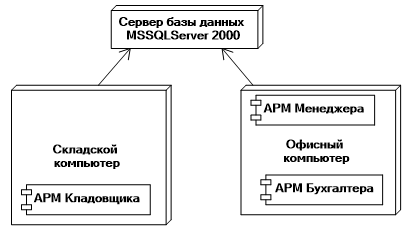

| Диаграмма | Размещения |
|:---|:---|
| Содержит | графическое представление IT-инфраструктуры |
|  | топологию системы и распределение компонентов, их соединения |
| Используется | для аппаратно-программных систем |
| Подходит | для рационального распределения компонент |
|  | для решения вспомогательных задач (например: безопасность) |


## 15. *UP методологии (90-е). RUP: основы процесса.
    


## 16. RUP: Фаза «Начало».

стр. 22
    
Каждая фаза заканчивается вехой - переход на следующий этап.

Цели:
- Определение границ проекта
- Описание основных сценариев использования системы
- Разработка технологических решений
- Оценка рисков
- Подготовка окружения
- Расчет стоимости!

Веха Lifecycle Objects:
- Согласие сторон в оценке сроков, первоначальной стоимости, требованиях, приоритетах, технологиях
- Оценены риски и выбраны стратегии смягчения последствий 

| Фаза | Начало |
|:---|:---|
| Направление работ | Оценка проекта |
| Артефакт | Концепция ("Vision") |
| Веха | Lifecycle Objects |


## 17. RUP: Фаза «Проектирование» (уточнение).
    
стр. 23

**Исполняемая архитектура** — полностью законченные на базе выбранных технологий несколько характерных функций разрабатываемой системы.

Тестирование на этом этапе нужно для проверки основных **нефункциональных требований** (например пропускная способность)

- Документирование требований (включая детальное описание для большинства прецедентов).
- Сниженные основные риски.
  
Цели:
- Финализировать базовую архитектуру
- Разработать прототип
- Убедиться, что архитектура, планы и сроки стабильны, риски учтены
- Продемонстрировать, что архитектура подходит под требования

  Веха Lifecycle Architecture – веха стабильности
  
Веха Lifecycle Architecture:
- Концепция, требования, архитектура проекта стабильны?
- Сформированы критерии тестирования прототипов?
- Тестирование прототипов показало отсутствие основных рисков?
- Планы разработки подробны и приемлемы по цене?
- Решают вопрос с деньгами


| Фаза | Проектирование |
|:---|:---|
| Направление работ | Разработка и тестирование |
| Артефакт | Спроектированная, реализованная и оттестированная исполняемая архитектура, Экономическое соглашение |
| Веха | Lifecycle Architecture |

Заказчик может менять соглашение по деньгам.

## 18. RUP: Фаза «Построение».

В фазе «Построение» происходит реализация большей части функциональности продукта.

Фаза Построение завершается первым внешним релизом системы и вехой начальной функциональной готовности (Initial Operational Capability).

Цели:
- "Быстро, дешево, сердито"
- Итеративно и инкрементально провести анализ, проектирование, разработку и тестирование
- Подготовить продукт и пользователей

Фаза Initial Operational Capability:
- Достаточно ли стабилен релиз?
- Все стороны готовы к релизу для юзеров
- Все еще норм по деньгам?

| Фаза | Построение |
|:---|:---|
| Направление работ | Усиленная разработка |
| Артефакт | альфа- и бета-версии |
| Веха | Initial Operational Capability |

## 19. RUP: Фаза «Внедрение».

В фазе «Внедрение» создается финальная версия продукта и передается от разработчика к заказчику. 

Это включает в себя программу бета-тестирования, обучение пользователей, а также определение качества продукта. 

В случае, если качество не соответствует ожиданиям пользователей или критериям, установленным в фазе Начало, 
фаза Внедрение повторяется снова. Выполнение всех целей означает достижение вехи готового продукта (Product Release) 
и завершение полного цикла разработки.

Цели:
- Бета-тестирование
- Запуск маркетинга и продажи
- Отладка процессов устранения сбоев
- Открытый анализ соответствия ПО требованиям

Веха Product Release:
- Пользователи довольны?
- Че там с деньгами?

| Фаза | Внедрение |
|:---|:---|
| Направление работ | Тестирование качества, релиз |
| Артефакт | Релиз |
| Веха | Product Release |

## 20. Манифест Agile (2001).

Мир изменчив, бизнесу важно иметь возможность оперативно реагировать  
на изменчивый мир, внося правки (какая-то фича срочно нужна вчера).  
**RUP такой возможности не давал.**  

- **Люди и взаимодействия** важнее процессов и инструментов.  
- **Работающий продукт** важнее исчерпывающей документации.  
- **Сотрудничество с заказчиком** важнее согласования условия контракта.
- **Готовность к изменениям** важнее следования первоначальному плану.  
    не отрицая важности правого, мы больше ценим левое  

### 12 принципов AGILE:

- Удовлетворение требований заказчика
- Изменения требований приветствуются
- Частые выпуски программного продукта
- Ежедневная совместная работа
- Мотивированные профессионалы
- Непосредственное общение
- Работающий продукт -- показатель прогресса
- Постоянный ритм
- Техническое совершенство
- Простота
- Самоорганизующиеся команды
- Систематическая коррекция

## 21. Scrum.  

Скрам -- фактическая реализация принципов Agile.  

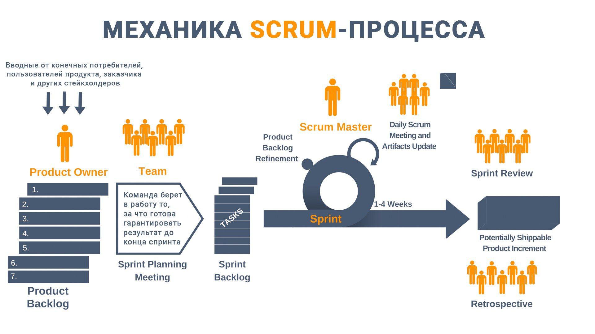

**Product owner** - знает, что нужно сделать и в какой последовательности.  
**Product backlog** - высокоуровневые требования к ПО, которые нужно реализовать.  
**Sprint backlog** - детализированный backlog на 1 спринт (1-4 недели).  
**Daily scrum** - daily meet up  
**Scrum master** - опытный парень, следит за процессом, помогает с декомпозицией
требований (product backlog -> sprint backlog)

## 22. Disciplined Agile 2.X (2013).  
Развитие Scrum привело к попытке совместить преимущества RUP со Scrum.  
Инкрементальная модель разработки опирается на модель спринтов.  
Подразумевается, что disciplined agile можно натянуть на большое-большое  
предприятие (в отличие от Scrum).  

**Взяв плюшки от RUP получаем масштабируемость**

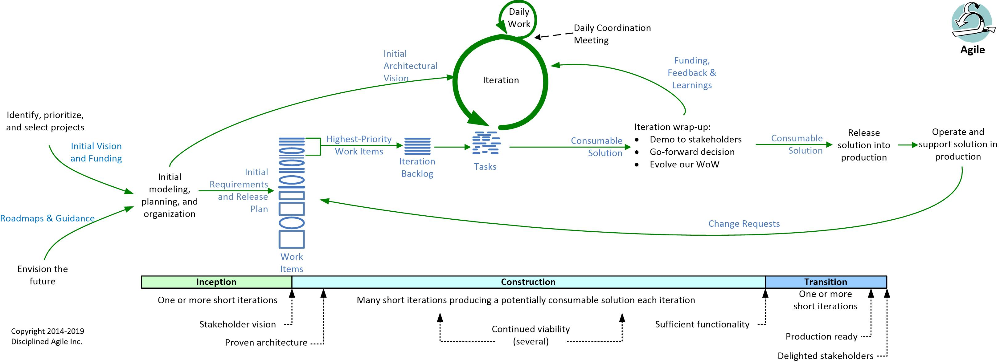  

## 23. Требования. Иерархия требований.  
- Требования -- условия или возможности, которым должна соответствовать система.  
- Требование -- подробное описание того, что должно быть реализовано.  
- Требование не описывает, как его необходимо реализовывать.  

Требования описываются в документе **Software Requirements Specification**(как на 1-ой лабе в отчете).  

Важно исключить разночтения требований, чтоб потом не попасть на бабос.  


## 24. Свойства и типы требований (FURPS+).  

- Корректность
- Однозначность
- Полнота
- Непротиворечивость
- Приоритизация
- Проверяемость
- Модифицируемость
- Отслеживаемость

FURPS — классификация требований к программным системам.
Образована от первых букв слов:

- Functionality — Функциональные требования: свойства, возможности, безопасность.  
  Являются основными, по этим требованиям строятся диаграммы вариантов использования (Use case diagram).
- Usability — Требования к удобству использования (UX): человеческий фактор, эстетика,  
  последовательность, документация.
- Reliability — Требования к надежности: частота возможных сбоев, отказоустойчивость,  
  восстанавливаемость, предсказуемость устойчивости.
- Performance — Требования к производительности: время отклика, использование ресурсов,  
  эффективность, мощность, масштабируемость.
- Supportability — Требования к поддержке: возможность поддержки, ремонтопригодность,  
  гибкость, модифицируемость, модульность, расширяемость, возможность локализации.


## 25. Формулирование требований. Функциональные требования.

{id}{система}должна/shall{требование}
- id -- уникальный идентификатор в системе контроля и изменения требований
- система -- имя системы или подсистемы.
- должен/shall -- юридически обязывающее словно.
- требование -- требование, которое должно быть исполнено.  

Функциональные требования определяют:  
- Feature sets -- наборы функциональных требований
- Capabilities -- возможности ПО
- Security - безопасность

## 26. Требования к удобству использования и надежности.  

Usability:
- Human factors -- учет особенностей пользователей (плохое зрение, слух).
- Aesthetics -- эстетические требования. (Толстый брендбук)
- Consistency in the user interface -- согласованность пользовательского интерфейса.
- Online and context-sensitive help -- требования к справочной подсистеме.
- Wizards and agents -- мастера (пошаговая штуковина) и ПО, повышающие продуктивность и простоту  
  работы пользователя.
- User documentation -- требования к пользовательской документации.
- Training materials -- требования к учебным материалам.


Reliability:
- Frequency and severity of failure -- частота и обработка отказов.
- Recoverability -- способность системы восстанавливать своё продуктивное состояние.
- Predictability -- предсказуемость поведения  
- Availability -- готовность системы к решению задач
- Accuracy -- точность
- MTBF -- среднее время между отказами
- Коэффициент готовности -- связь между средним временем между отказами  
и временем восстановления системы.

## 27. Требования к производительности и поддерживаемости.

Performance:
- Speed -- скорость решения задач
- Efficiency -- эффективность
- Throughput -- пропускная способность
- Response time -- время отклика 
- Recovery time -- время восстановления
- Resource usage -- использование системных (и других) ресурсов
  (все эти требования связаны и задаются сообща, а не по отдельности)

Supportability:
- Extensibility -- расширяемость
- Adaptability -- адаптируемость под конкретные задачи
- Maintainability -- поддерживаемость
- Compatibility -- совместимость
- Configurability -- способность задавать конкретную конфигурацию
- Serviceability -- возможность проведения профилактик и обслуживания
- Installability -- требования к установке на разные системы
- Localizability -- локализуемость для разных для разных языком и географических регионов

## 28. Атрибуты требований.

1. Приоритет -- MoSCoW
    - MUST have (Minimum Usable Subset) -- фундаментальные  
    для системы требования  
    - Should have -- важные
    - Could have -- потенциально возможные, улучшающие, к примеру пользовательское отношение
    - Won't have (Would like to have) -- мб в следующей версии  

2. Статус:  
    - предложенные, одобренные, отклоненные, включенные  
3. Трудоемкость:  
    - человеко-часы (чаще всего), функциональные точки,  
      use-case points, попугаи
4. Риск
5. Стабильность:  
    - высока, средняя, низкая
6. Целевая версия:  
    - когда включим в продукт?

## 29. Описание прецедента.  

Прецеденты(case) могут быть описаны в виде сценариев или,  
как, сейчас принято(модно) - user story.  

В дальнейшем разработчики зачастую анализируют ни сколько требования, сколько сценарии.

use-case description in RUP


## 30. Риски. Типы Рисков.

Риск — потенциально опасный для проекта фактор.

Риски бывают:
- Прямые
    - можем в ясном виде управлять: уменьшать вероятность возникновения, реагировать
- Непрямые
    - зависят от внешних факторов
    - не поддаются управлению

| Тип | Характеристика / Пример | Чья компетенция |
|:---|:---|:---|
| Ресурсные  (управляемые) | Организационные, финансовые, **люди**, время | Менеджеры |
| Бизнес-риски (неуправляемые) | Конкуренция, подрядчики, убыточность решения | Стейкхолдеры |
| Технические (упр) | Границ проекта, технологические, внешние API | Разработчики ПО |
| Политические (неупр)| Сферы влияния менеджеров |
| Форс-мажор (неупр)| |

## 31. Управления рисками. Деятельности, связанные с оценкой.

Что можно/нужно делать для снижения рисков?
    
### Идентификация рисков


Классы рисков -> Элементы -> Атрибуты, которые указывают на возможные источники возникновения рисков.

### Анализ рынка

- Различные модели и методы анализа: стоимостной, сетевой, качественной факторов
    - так как работа осуществляется людьми, то данные параметры обычно задаются нечетко
- Вероятность и масштаб потерь

### Приоритизация рисков

- Risk Exposure: `RE = Prob(UO) * Loss(UO)` - произведение вероятности наступления риска на величины денежных потерь
- Другие факторы анализа
- Создается документ "ТОП-10 рисков"

## 32. Управления рисками. Деятельности, связанные контролем и управлением.

### Планирование реакции

- Избегание риска, реорганизация проекта
- Перенос риска (на кого-то)
- Сокращение вероятности риска -> Использование более проверенного стороннего ПО
- Прием риска -> Проработка рисков заранее

### Разрешение риска

- Прототипы системы
- Моделирование и симуляция 
- Различные индикаторы
- Аналитическая работа
- Подбор персонала

### Мониторинг рисков

- Во время итераций разработки
- ТОП-10 список
- Переоценка рисков
- Автоматизация системы
    - Числовые параметры
    - Автоматический сбор из вспомогательных систем: Контроль версий, управление задачами + плагины Jira

## 33. Изменение. Общая модель управления изменениями.

Изменение — контролируемое, журналируемое обновление системы. 


## 34. Системы контроля версий. Одновременная модификация файлов.

### Системы контроля версий

- Управляют изменениями в коде
- Поддерживают групповую работу
- Основные типы:
    - На основе файловой системы
    - Централизованные (svn)
    - Распределенные (git)

### Одновременная модификация файлов

- Lock-modify-unlock:
    - В основном в VCS на файловых системах
    - Замедляет работу команду
- Copy-modify-merge:
    - Своя рабочая копия у каждого
    - Трудности слияния

## 35. Subversion. Архитектура системы и репозиторий.

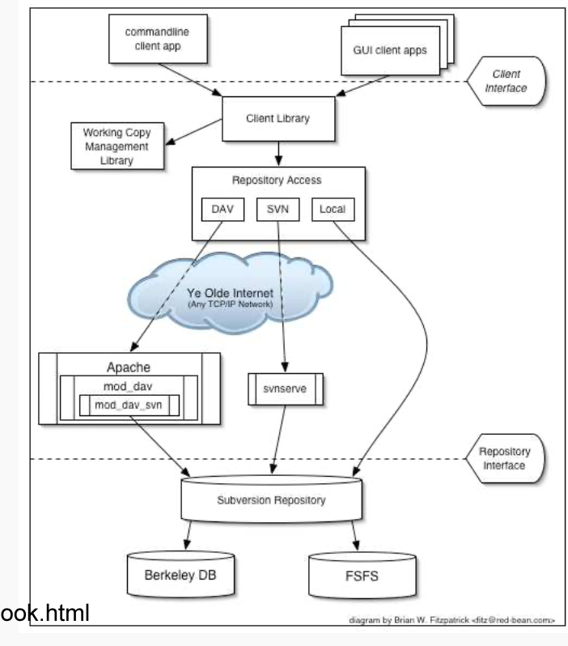

1) Хранение самого уровня репозитория, который 
лежит или в Berkeley DB или FSFS
2) Доступ к репозиторию - svnserve, демон, через который отдаем команды
3) Удаленный доступ - svn+https и ssh+svn 
4) Также управление локальными копиями файлов, которые изменяет сам разработчик

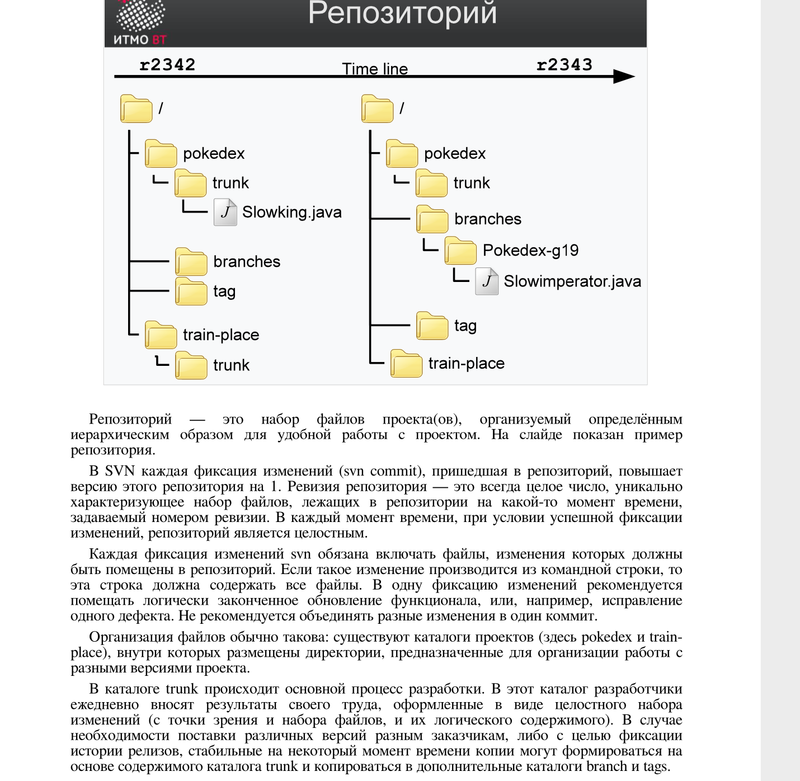

Ветки:

trunk - основная ветка разработки

branches - все остальные ветки проекта ( + модификации сторонних библиотек)

tag - релиз версия продукта или каталог с минорной версией для исправления дефектов 

## 36. Subversion: Основной цикл разработчика. Команды.


## 37. Subversion: Конфликты. Слияние изменений.

В случае слияния файлов часто случаются проблемы в содержимом файлов(те внесенная разработчиками
информация противоречит друг другу(условно)). 

В svn есть различные способы решения конфликтов:

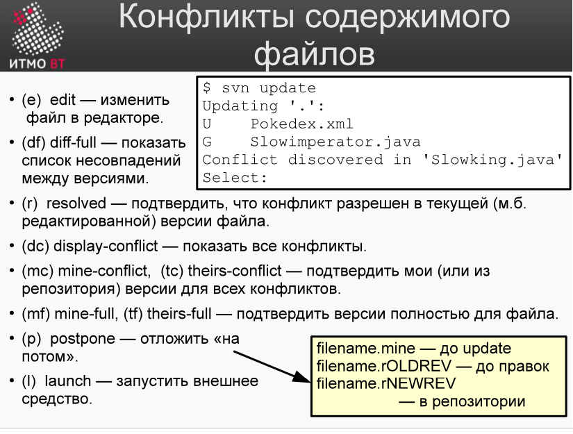

Также стоит учитывать, что в IDE обычно имеются средства GUI, в которых можно удобно просматривать
конфликты содержимого файлов


В случае, если нам требуется слить изменения из различных веток, хорошей практикой будет 
использование команды svn merge

## 38. GIT: Архитектура и команды.

GIT - распределенная система контроля версий

Особенность архитектуры GIT состоит в присутствии локальной копии проекта у каждого из разработчиков, 
а также возможности выборочного применения доступных изменений

Исходя из этого, рабочий процесс строится на основании одной из трех стратегий.

1) централизованный рабочий процесс - по сути как в SVN
2) Рабочий процесс с менеджером по интеграции - каждый дев работает отдельно, далее коммитит, 
и далее есть отдельный мужик, который занимается слиянием всего
3) Рабочий процесс с диктатором и лейтенантами - аналог принципа работы пункта №2, но есть умный чел,
репозиторий которого выступает как эталонный

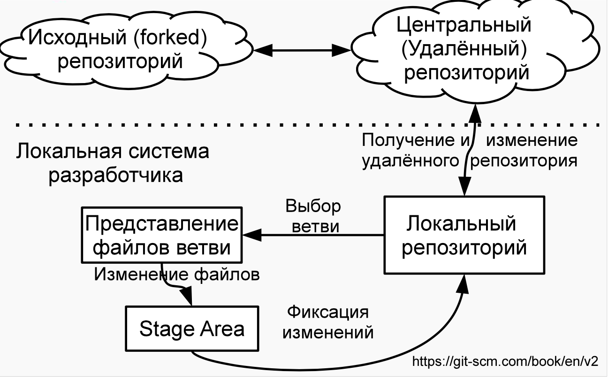


Список команд от Клименкова:

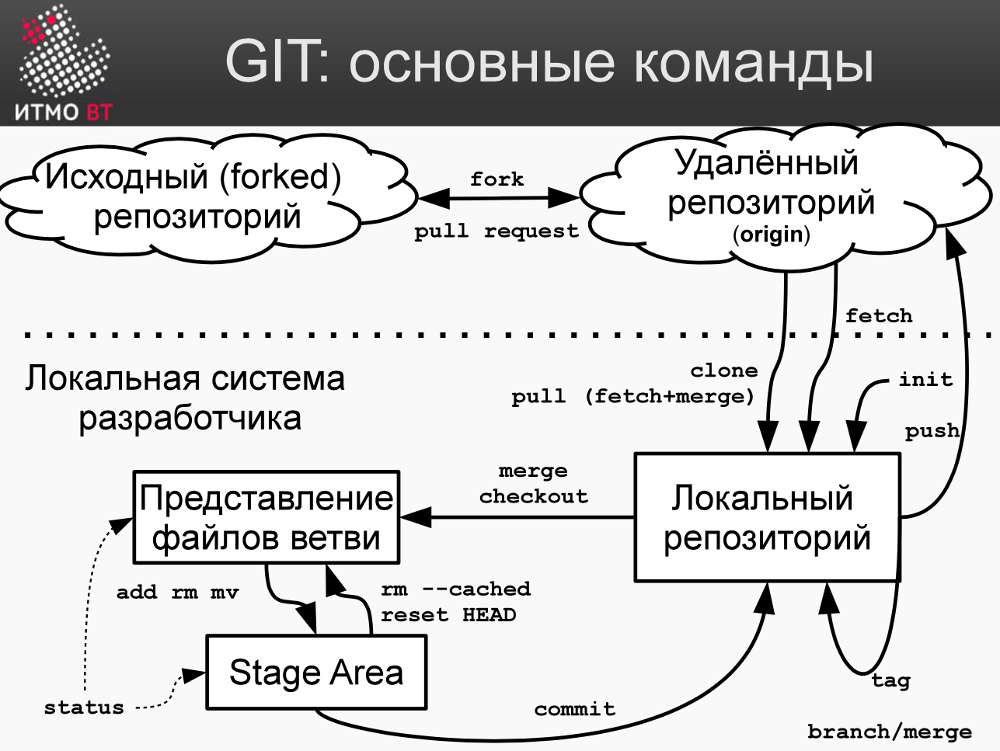


## 39. GIT: Организация ветвей репозитория.

Философия GIT в том, что каждое отдельное изменение должно разрабатываться в отдельной ветви.

`Master` - в данной ветке находятся основные версии продукта

`Develop` - в данную ветку все разработчики сливаются свои изменения, связанные с функциональностью
продукта, далее ветка перетекает в Master.

`Feature` - эти ветки создаются как подмножества Developer. Туда аккумулируются коммиты и после завершения
разработки функционала, ветка сливается в Develop.

`Release` - после того, как разработка на Develop завершена, идет тщательная проверки и данная ветка используется для 
внесения изменений, которые мешают выпуску новой версии. Далее все сливается в Develop и процесс на ветке запускается заново.

`Hotfix` - ветка для критических исправлений по ходу работы у пользователя. Изменения с нее сливаются как в Master,
так и в Develop.

## 40. GIT: Плагин git-flow.

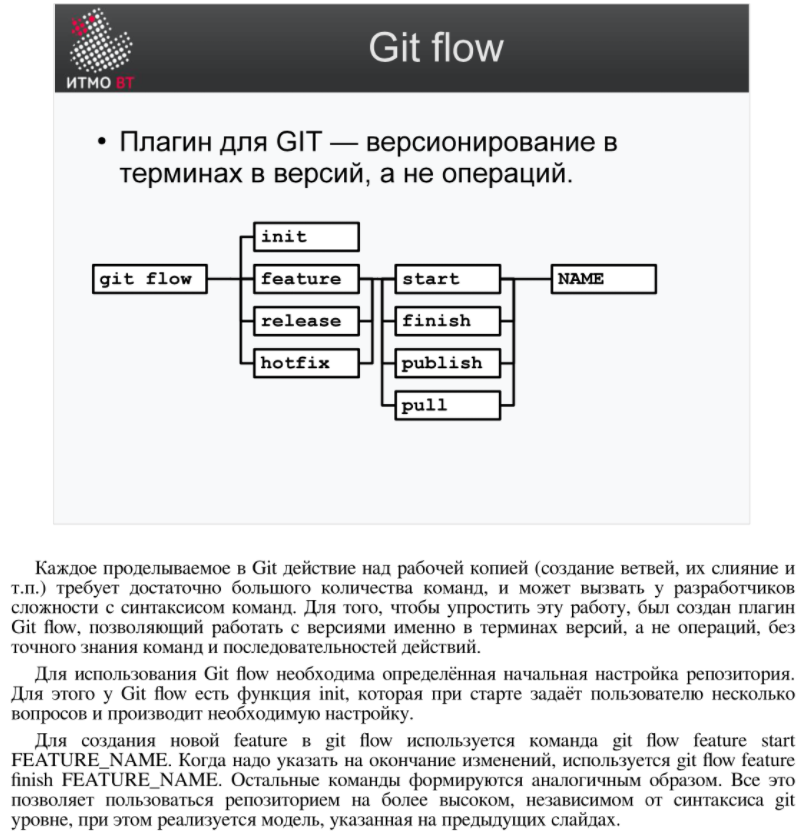

Git Flow - расширение Git. Философия заключается в работе над версионированием в терминах релиза версий, а не самих операций


## 41. Системы автоматической сборки: предпосылки появления
1) Рутинный процесс сборки
2) Отличия архитектуры информационных систем
3) Медленная сборка

Если брать параллельные процессы компиляции, то возникает проблема доступа сборочных узлов к общим исходным 
кодам проекта

Вышеперечисленные причины и привели к появлению разнообразных систем сборки

## 42. Системы сборки: Make и Makefile.

Make - система сборки, появившаяся впервые в Unix-системах, существует и по сей день.

Является императивной(условно) системой сборки. Исходный код сборки располагается в Makefile, который
в свою очередь располагается в корневой директории проекта. Далее в корневой директории прописывается
команда "make" и происходит сборка проекта. По умолчанию основной направленностью maka являются "file targets". 
Чтобы сказать Make, что мы хотим работать не с файлами, а с наименованием цели, используем слово "PHONY".
Основная цель - all. Пример цели:
```
all:
    gcc -o main main.c
```   
## 43. Системы сборки: Ant. Команды Ant.
Apache Ant представляет собой императивную систему сборки, использующую в качестве основного файла build.xml.
Разрабатывалась для использования в Java-проектах. Файл состоит из target, в которых описана определенная
последовательность действий для достижения поставленной цели. Пример простого build.xml.
```xml
<project name="MyProject" default="dist" basedir="../../../../..">
  <property name="src" location="src"/>
  <property name="build" location="build"/>

  <target name="init">
    <mkdir dir="${build}"/>
  </target>

  <target name="compile" depends="init">
    <javac srcdir="${src}" destdir="${build}"/>
  </target>
</project> 
``` 


## 44. Системы сборки: Ant-ivy.
Apache Ivy - транзитивный менеджер пакетов, который использутся совместно с Apache Ant.
Пакет скачивает из Maven-репозитория(определение см ниже). Для конфигурации использует файлы 
ivysetting.xml и ivy.xml.

В головной build.xml подключиется при помощи:

```xml
<project name="MyProject" xmlns:ivy="antlib:org.apache.ivy.ant" default="dist" basedir=".">
    <target name="resolve">
        <ivy:retrieve/>
    </target>
```
Пример зависимости:

```xml
<ivy-module version="2.0">
<info organisation="org.apache" module="hello-ivy"/>
<dependencies>
    <dependency org="jakarta.annotation" name="jakarta.annotation-api" rev="1.3.5" />
</dependencies>
</ivy-module>
``` 


## 45. Системы сборки: Maven. POM. Репозитории и зависимости.
Apache Maven - одна из самых популярных систем сборки для Java-проектов на 
сегодняшний день. Использует декларативный подход. Основным файлом выступаем POM,
(Project Object Model)(основной файл - pom.xml)

```xml
<project xmlns="http://maven.apache.org/POM/4.0.0"    xmlns:xsi="http://www.w3.org/2001/XMLSchema-instance"  xsi:schemaLocation="http://maven.apache.org/POM/4.0.0 http://maven.apache.org/xsd/maven-4.0.0.xsd">    
  
  <modelVersion>4.0.0</modelVersion>  
  <groupId>com.javatpoint.application1</groupId>  
  <artifactId>my-app</artifactId>  
  <version>1</version> 
   
</project>  
```

В POM указываются имя, версия и тип программы, местоположение исходных кодов проекта
зависимости, плагины, альтернативные конфигурации проекта

Репозитории и зависимости.


## 46. Maven: Структура проекта. GAV.


В Maven существует система каталогов по умолчанию (src/main/java - исходные коды проекта)
(src/main/resources - дополнительные файлы проекта, `.proprties` файлы)

После работы готовые файлы кладутся в директорию target

GAV.

В Maven все зависимости описываются в GAV-синтаксисе, который представляет собой:
groupId:artifactId:version. Так описывается любая внешняя зависимость. Данные зависимости
скачиваются из интернета, поэтому если это не нужно, надо запретить в явном виде.

```xml
<project>
  <modelVersion>4.0.0</modelVersion>
  <groupId>com.mycompany.app</groupId>
  <artifactId>my-app</artifactId>
  <version>1</version>
</project>
```

## 47. Maven: Зависимости. Жизненный цикл сборки. Плагины.

Зависимости см пункт выше


## 48. Системы сборки: Maven. POM. Репозитории и зависимости.

СМ. 45-47

## 49. Системы сборки: GNU autotools. Создание конфигурации проекта.

Autotools, или система сборки GNU,— это набор программных средств, предназначенных для поддержки переносимости исходного кода программ между UNIX-подобными системами.

Требуемая последовательность команд для запуска: ./configure && make && make install

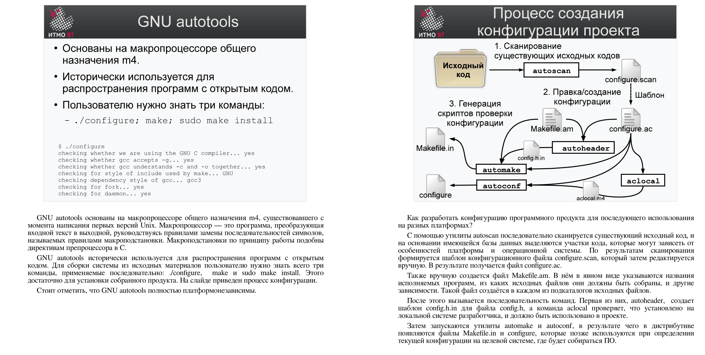

## 50. Системы сборки: GNU autotools. Конфигурация и сборка проекта.


## 51. Сервера сборки/непрерывной интеграции.


Непрерывная интеграция (CI, англ. Continuous Integration) — практика разработки программного обеспечения, которая заключается в постоянном слиянии рабочих копий в общую основную ветвь разработки (до нескольких раз в день) и выполнении частых автоматизированных сборок проекта для скорейшего выявления потенциальных дефектов и решения интеграционных проблем. В обычном проекте, где над разными частями системы разработчики трудятся независимо, стадия интеграции является заключительной. Она может непредсказуемо задержать окончание работ. 

Переход к непрерывной интеграции позволяет снизить трудоёмкость интеграции и сделать её более предсказуемой за счёт наиболее раннего обнаружения и устранения ошибок и противоречий, но основным преимуществом является сокращение стоимости исправления дефекта, за счёт раннего его выявления.

| Плюсы | Минусы |
|:---|:---|
| проблемы интеграции выявляются и исправляются быстро, что оказывается дешевле | значительные затраты на поддержку работы непрерывной интеграции |
| немедленный прогон модульных тестов для свежих изменений | необходимость в дополнительных вычислительных ресурсах под нужды непрерывной интеграции |
| постоянное наличие текущей стабильной версии вместе с продуктами сборок — для тестирования, демонстрации, и т. п. |  |
| немедленный эффект от неполного или неработающего кода приучает разработчиков к работе в итеративном режиме с более коротким циклом |  |

## 52. Основные понятия тестирования. Цели тестирования.

Цели тестирования (Testing goals)
1. Показать разработчику и клиенту, что программное обеспечение отвечает заявленным требованиям.
2. Найти ситуации, когда программное обеспечение ведет себя ошибочно, нежелательно или не соответствует спецификации.
3. Создать предпосылки для предупреждения возникновения ошибок в программном обеспечении.


## 53. Понятие полного тестового покрытия и его достижимости. Пример.


## 54. Статическое и динамическое тестирование.

1. Статическое тестирование – тип тестирования, который предполагает, что программный код во время тестирования не будет выполняться. При этом само тестирование может быть как ручным, так и автоматизированным.
Статическое тестирование начинается на ранних этапах жизненного цикла ПО и является, соответственно, частью процесса верификации. Для этого типа тестирования в некоторых случаях даже не нужен компьютер – например, при проверке требований.
Большинство статических техник могут быть использованы для «тестирования» любых форм документации, включая вычитку кода, инспекцию проектной документации, функциональной спецификации и требований.
Даже статическое тестирование может быть автоматизировано – например, можно использовать автоматические средства проверки синтаксиса программного кода.

2. Динамическое тестирование – тип тестирования, который предполагает запуск программного кода. Таким образом, анализируется поведение программы во время ее работы.
Для выполнения динамического тестирования необходимо чтобы тестируемый программный код был написан,скомпилирован и запущен. При этом, может выполняться проверка внешних параметров работы программы: загрузка процессора, использование памяти, время отклика и т.д. – то есть, ее производительность.
Динамическое тестирование является частью процесса валидации программного обеспечения.


## 55. Автоматизация тестов и ручное тестирование.

Одна из целей автоматизации - иметь возможность повторять тестовый сценарий несколько раз. 

Важно: Не все тесты следует автоматизировать! В любой компании есть достаточное количество ручных тестировщиков. Основная причина - тесты к сожалению не покрывают весь функционал и найдется такой путь когда надо будет посмотреть быстренько что нибудь в ручную.

- **Регрессионное тестирование** - такое тестирование в котором при исправлении какого либо дефекта в системе, мы должны понять(протестировать) что у нас не развалились другие модули.
- **Повторение тестового сценария** - используется при регрессионном тестировании.
- **Сокращение ручного труда** - тут зависит от ситуации. Иногда ручному тестировщику быстрее сделать тест. А для того чтобы разработать автоматизированный тест тоже нужно время немалое. Поэтому определенно сказать что автоматизированные тесты сокращают количество ручного труда нельзя. В каких то сократит в каких то нет. Но чем больше ПО чем больше нужно сокращать ручной труд и увеличивать количество автоматизированных тестов.
- **Приемочное тестирование** - Автоматизация тестов может использоваться как “чек” к приемочному тестированию. 
- **Проверка одного приложения в разных окружениях** - Ну типо есть какая то управлялка тестами и она запускает на разных ос тесты эти. Т е отпадает необходимость по отдельности на каждой платформе проверять тесты. (можно реализовать например с помощью Selenium)

Примеры программ для автоматизированного тестирования: Selenium, TestingWhiz, Sahi, Watir.

## 56. Источники данных для тестирования. Роли и деятельности в тестировании.

Источники данных для тестов:
- Метод черного ящика - описания ПО 
    - спецификации, требования, дизайн
    - запуск и сравнение результатов с эталоном
- Метод белого ящика - исходный код
    - переходы, утверждения, условия
    - анализ путей, структуры
- Опыт
- Модели 
    - UML

Примечание: подробнее о методе “черного ящика” и “белого ящика” смотрите в вопросе №59

Роли и деятельности в тестировании деляться на несколько больших категорий:
- **Проектирование тестов**. Квалификация спецов проектирующих тесты должна быть высокой и включать в себя знание предметной области, особенностей UI, а также дискретной математики, навыков проги и тестирования
- **Автоматизация тестов**. Обычно этим занимаются прогеры, которые специализируются на разработке тестов скриптов или программ. Принято, что модульные тесты пишут сами разрабы, а интеграционные и системные тесты пишут отдельно выделенные прогеры с глубокими представлениями о архитектуре и взаимодействии различных частей приложения.
- **Непосредственное исполнение тестов** не требует высокой квалификации персонала. Тем не менее, этот персонал должен знать тестовую инфраструктуру, принципы работы с тестируемым приложением и обладать элементарными скилами работы с компом.
- Для **анализа результатов тестов** требуются как знания в предметной области, так и технические знания. Поэтому для данной деятельности необходимо достаточно высокая квалификация персонала.

**Мини вывод** - для организации и проведения полноценного тестирования нужна квалифицированная подготовка, и ко многим участникам процесса тестирования программы предъявляются более высокие требования, чем к ее рядовым разрабам.

## 57. Понятие тестового случая и сценария.

**Тестовый случай** состоит из набора входных значений, предусловий выполнения, ожидаемых результатов и постусловий.
- Входные значения - набор данных, на которых разрабатываемое ПО должно вести себя определенным образом с точки зрения спецификации требований к ПО или других источников инфы о поведении программы.
- Ожидаемые результаты - создаются как часть спецификаций тестовых сценариев и включает в себя выходные данные, изменения в данных и состояниях, и любые иные последствия теста. 

Примечание: В идеальных условиях ожидаемые результаты должны быть определены до момента выполнения теста (TDD - test-driven development). TDD - разработка через тестирование. Смысл - разраб сначала описывает тестовое покрытие и разрабатывает тесты для этого покрытия. Затем он начинает разрабатывать ПО, и с каждым его    запуском растет кол-во тестов выполненных успешно. Разработка считается завершенной, когда будут успешно выполнены все тесты.

- Тестовый случай должен быть повторяемый, то есть одинаковый набор входных значений и состояний должен приводить к одинаковым выходным значениям или состояниям
- Для повторяемости теста желательно автоматизировать его поведение.
- Необходимо тестить как нормальные пользовательские сценарии так и те, которые приводят к ошибкам.

**Тестовый сценарий** - это последовательность тестовых случаев!
В тестовых сценариях должно быть предусмотрено появление как положительной, так и отрицательной реакции системы на действия пользователей. Для неправильных действий пользователя также создаются тестовые сценарии.


## 58. Выбор тестового покрытия и количества тестов. Анализ эквивалентности.

При планировании тестированию следует соблюдать баланс между качеством и скоростью вывода продукта в эксплуатацию. Больше тестов -> покрытие растет -> рост качества, но также растет затрачиваемое время и ресурсы.

Количество тестовых сценариев необходимо выбирать с учетом того, что полное тестовое покрытие недостижимо. 

Рассмотрим набор методов, которые позволяют определить достаточное тестовое покрытие: 
- **Эквивалентное разбиение (партиции эквивалентности)** - анализ граничных значений, внутри которых тестируемая функция ведет себя одинакового.
- **Таблица решений (альтернатив)** - Составляется таблица, отражающая комбинации входных данных с соответствующими выходными данными, которая может быть использована для проектирования тестовых сценариев, которые необходимо провести для группы таких сочетаний.
- **Таблицы переходов** - выделяются явные состояния внутри системы, определяются переходы между этими состояниями, которые далее покрываются тестами
- **Сценарии использования** - могут служить источником данных для формирования тестового покрытия. При этом в каждый описанный сценарий добавляются конкретные значения, вводимые пользователем. Нужно учитывать как основные, так и альтернативные пути сценария. Обычно каждому такому пользовательскому сценарию соответствует целая группа тестовых сценариев.

**Анализ эквивалентности** - функция или модуль разбиваются на участки, где программа ведет себя одинакового (эквивалентно). Внутри каждого участка формируется свой набор тестовых случаев. Если таких участков относительно немного, это позволяет резко сократить кол-во тестовых случаев. Отдельные тесты составляются для граничных значений участков.


## 59. Модульное тестирование. Junit 4.

[Почитать]((https://habr.com/ru/post/120101/) )

### Модульное тестирование

**Модуль** - это компонент, который необходимо протестировать отдельно от остального программного продукта. Модуль выполняет некую законченную функцию.

- IEEE 610
- Модули описаны в дизайне
- Для тестирования необходимо изолировать модуль из системы

Для проведения модульного тестирования, модуль необходимо изолировать из системы. Для этого юзаются драйвера (вместо вызывающего модуля) и заглушки (вместо подчиненного модуля).
Драйвер - компонент, вызывающий модули и обеспечивающий последовательность тестирования. Драйвер должен вызывать тестируемый модуль с различными входными параметрами и условиями. 
Заглушка - ведет себя подобно подчиненному модулю, имеет тот же интерфейс, но гораздо более простую реализацию. При вызове заглушка возвращает заранее определенные значения. 
Картинка для понимания:


Стратегии модульного тестирования:
- метод “Черного ящика” - подразумевается, что внутреннее содержимое проги скрыто. Работа при таком тестировании идет на уровне спецификации или на основе опыта составления тестов. Тесты подают на вход проги исходные данные и сравнивают результат с известным эталоном. Источниками данных для тестов являются спецификации, требования и дизайн.
- метод “Белого ящика” - У нас есть возможность исследовать исходники. Плюс данный метод дает возможность оценить размер тестовго покрытия. 

Вкратце:
- Черный ящик - не знаем что находится под капотом
- Белый ящик - знаем что находится под капотом


### JUnit
- простейший фреймворк, позволяющий создать модульные тесты и выполнить их в определенном окружении. JUnit4 построен на аннотациях. Как работает - фреймворк последовательно просматривает загружаемые классы (с помощью reflection API) и ищет в них нужную аннотацию. Все методы с найденной аннотацией запускаются (мб и в разных потоках)


Внутри тестового метода проверяется тестовое покрытие на соответствие определенным условиям при помощи специальных функций проверки, которые называются assertion. 

В JUnit4 существует большой набор таких функций, которые могут:
- проверять на равенство
- проверять на совпадения
- появления исключительной ситуации и тд

Результаты тестов заносятся в специальный журнал для последующего анализа.

Примечание: Последовательность тестов в JUnit не регламентирована (порядок конечно можно и искусственно определить, но по дефолту считается, что все тесты выполняются параллельно и независимо). JUnit сам определяет, каким образом будет запущено тестирование.


## 60. Интеграционное тестирование. Стратегии интеграции.

Интеграционное тестирование - это тип тестирования, при котором программные модули объединяются логически и тестируются как группа. Как правило, программный продукт состоит из нескольких программных модулей, написанных разными программистами. Целью нашего тестирования является выявление багов при взаимодействии между этими программными модулями и в первую очередь направлен на проверку обмена данными между этими самими модулями. (https://logrocon.ru/news/intgration_testing)

Программная инженерия задает различные стратегии интеграционного тестирования:
- Подход Большого взрыва.
- Инкрементальный подход:
    - Нисходящий подход (сверху вниз)
    - Подход «снизу вверх»
    - Сэндвич - комбинация «сверху вниз» и «снизу вверх»


## 61. Функциональное тестирование. Selenium.
Selenium-Это инструмент для автоматизации действий веб-браузера. В большинстве случаев используется для тестирования Web-приложений, но этим не ограничивается. В частности, он может быть использован для решения рутинных задач администрирования сайта или регулярного получения данных из различных источников.
Функциональное тестирование — это тестирование ПО в целях проверки реализуемости функциональных требований, то есть способности ПО в определённых условиях решать задачи, нужные пользователям.
## 62. Техники статического тестирования. Статический анализ кода.
Статический анализ кода — анализ программного обеспечения, производимый (в отличие от динамического анализа) без реального выполнения исследуемых программ. В большинстве случаев анализ производится над какой-либо версией исходного кода, хотя иногда анализу подвергается какой-нибудь вид объектного кода, например P-код или код на MSIL. Термин обычно применяют к анализу, производимому специальным программным обеспечением, тогда как ручной анализ называют «program understanding», «program comprehension» (пониманием или постижением программы).
В зависимости от используемого инструмента глубина анализа может варьироваться от определения поведения отдельных операторов до анализа, включающего весь имеющийся исходный код. Способы использования полученной в ходе анализа информации также различны — от выявления мест, возможно содержащих ошибки (утилиты типа Lint), до формальных методов, позволяющих математически доказать какие-либо свойства программы (например, соответствие поведения спецификации).
## 63. Тестирование системы в целом. Системное тестирование. Тестирование производительности.
## 64. Тестирование системы в целом. Альфа- и бета-тестирование.
Альфа-тестирование (alpha testing) – это вид приемочного тестирования, которое обычно проводится на поздней стадии разработки продукта и включает имитацию реального использования продукта штатными разработчиками либо командой тестировщиков. Обычно альфа тестирование заключается в систематической проверке всех функций программы с использованием техник тестирования «белого ящика» и «черного ящика».
Преимущества альфа-тестирования:

Обеспечивает лучшее представление о надежности программного обеспечения на ранней стадии.
Помогает моделировать поведение пользователя и окружающую среду в режиме реального времени.
Обнаруживает много серьезных ошибок.
Дает возможность раннего обнаружения ошибок в отношении дизайна и функциональности.
Недостатки альфа-тестирования:

Функциональность не может быть проверена на всю глубину, поскольку программное обеспечение все еще находится на стадии разработки. Иногда разработчики и тестировщики недовольны результатами альфа-тестирования

Бета-тестирование (beta testing) – интенсивное использование почти готовой версии продукта с целью выявления максимального числа ошибок в его работе для их последующего устранения перед окончательным выходом (релизом) продукта на рынок, к массовому потребителю. Бета-тестирование представляет собой реально работающую версию программы с полным функционалом. И задача бета-тестов – оценить возможности и стабильность работы программы с точки зрения ее будущих пользователей.

В отличие от альфа-тестирования, проводимого силами штатных разработчиков или тестировщиков, бета-тестирование предполагает привлечение добровольцев из числа обычных будущих пользователей продукта, которым доступна упомянутая предварительная версия продукта (так называемая бета-версия).

Такими добровольцами (их называют бета-тестерами) часто движет любопытство к новому продукту – любопытство, ради удовлетворения которого они вполне согласны мириться с возможностью испытать последствия еще не найденных (а потому и не исправленных) ошибок. Кроме любопытства, мотивация может быть обусловлена желанием повлиять на процесс разработки и в итоге получать более удовлетворяющий их нужды продукт и многим другим. Очень хорошо, если это люди, которые уже имеют опыт работы с программами такого типа, а еще лучше – с предыдущей версией этой же программы. Обычно у компаний уже есть определенный круг лиц, с которыми они постоянно сотрудничают.

Бета-тестирование может быть:

Закрытым: Программа тестируется в небольшой группе пользователей по приглашениям.
Открытым: Этот вариант позволяет протестировать приложение в большей группе и получить большой объем обратной связи. Любой пользователь сможет присоединиться к открытому бета-тестированию и отправить личный отзыв.
Открытое бета-тестирования, например, может использоваться как часть стратегии продвижения продукта на рынок (например, бесплатная раздача бета-версий позволяет привлечь широкое внимание потребителей к окончательной дорогостоящей версии продукта), а также для получения предварительных отзывов о нём от широкого круга будущих пользователей.

Надо сказать, что разработчики не испытывают недостатка в желающих принять участие в такой работе. Такого рода сотрудничество приносит пользу обеим сторонам, ведь исправления проще сделать в процессе работы, а не когда она уже завершена, к тому же замечания и пожелания пользователей позволяют сделать программное обеспечение лучше и качественней.

Преимущества бета-тестирования:

Снижает риск выхода продукта из строя посредством валидации клиента.
Бета-тестирование позволяет компании тестировать инфраструктуру после запуска.
Повышает качество продукции благодаря обратной связи с клиентами.
Является экономичным методом сбора данных по сравнению с аналогичными методами.
Создает доброжелательность с клиентами и повышает удовлетворенность клиентов.
Недостатки бета-тестирования:

Управление тестированием – проблема. По сравнению с другими типами тестирования, которые обычно выполняются внутри компании в контролируемой среде, бета-тестирование выполняется в реальном мире, где у компании редко есть контроль.
Поиск правильных пользователей бета-версии и поддержание их участия может вызвать трудности.

## 65. Аспекты быстродействия системы. Влияние средств измерения на результаты.

стр. 149

Анализ производительности - научный эксперимент.
- выбрать критерии оценки
- выбрать средства измерения
    - Неинтрузивные средства измерения = не влияют на результат
- выбрать нагрузку
    - стараться имитировать нагрузку, похожую на настоящую
    - это бывает сложная задача
- анализ результатов
- сделать небольшое изменение в системе, один участок кода
    - чтобы оттестировать именно то, что изменяли
- повторять до полного удовлетворения

## 66. Ключевые характеристики производительности.

стр. 150

- Время отклика,
    - ожидание от воздействия на систему до получения первых данных 
- Время полного обслуживания 
    - от начала запроса до полного его завершения
- Пропускная способность
    - сколько запросов в единицу времени можно сделать
- Утилизация и ожидание ресурса 
- точка насыщения и масштабируемость
- Эффективность
    - 100% загруженность CPU не означает, что наша программа работает эффективно
- Ускорение и прирост производительности
    - что произошло после тестирования и улучшения производительности системы
- Java: Скорость запуска memory foorprint
    - связано с Garbage collector
    - то, как программа себя ведет внутри памяти
    - сервера приложений могут запускаться очень долго

## 67. Нисходящий метод поиска узких мест.

стр. 151

Классический "нисходящий" метод поиска узких мест:
- Исключение ошибок аппаратуры и администратора:
    - системные журналы, файлы конфигурации системы и прикладного ПО
- Общисистемный и межузловой мониторинг:
    - ОС сама собирает большое количество информации
    - Программисты обычно используют сторонние утилиты 
    - Если у вас кластер, для них есть отдельный набор своих утилит по мониторингу    
    - Анализируются: CPU, память, подсистема I/O, дисковые массивы, сеть, каналы передачи, ОС, виртуализация
- Мониторинг приложения: 
    - алгоритмы, проблемные API, многопоток, блокировки, синхронизации
    - сторонние прикладные API могут вредить производительности системы. Нужно четко понимать зачем нужна та или иная библиотека и какие накладные расходы она может дать. Можно она избыточная и проще будет написать какие-то модули руками
- Мониторинг микроархитектуры:
    - выравнивание данных — уверенность, что данные попадают в нужную строчку кэша
    - оптимизация кэшей
    - пузырьки конвейера
    - предсказание переходов

## 68. Пирамида памяти и ее влияние на производительность.

стр. 152

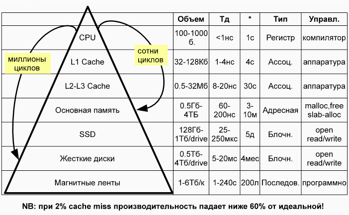

- CPU : самая быстрая и самая дорогая память 
- L1 : очень быстрая память. Находится максимально близко к ядрам процессора
- L2, L3 : тоже находятся внутри процессора.
- RAM : бОльшее время доступа, но и внушительный объем.
- SSD : Существенно медленнее оперативной памяти. Условно в 1000 раз медленнее
- HDD : Еще примерно в 1000 раз медленнее

* - масштаб времени относительно процессора

Обычно, чем выше в пирамиде памяти находится тип памяти, используемой системы, тем быстрее выполняется код. Недостаток верхних уровней(быстрой памяти) в том, что обычно они очень маленького размера. Поэтому приходится идти на компромисы и искать оптимальную память по соотношению скорости/объема. Примером работы с памятью является виртуальная память, которая из-за нехватки оперативной памяти использует постоянную.

## 69. Мониторинг производительности: процессы.

стр. 153

- CPU : user%, system%, idle% (простой), прерывания, смена контекста (ctxt_sw), средняя нагрузка
- IO :  число байт читаемых и записываемых за секунду, и за какое количество операций это происходит; время ожидания
- VM :  (Виртуальная память) : скорость выделения, освобождения страниц, пейджинга, swap'инга
- Сеть : счетчики принятых/переданных данных, коллизий и тд

Системный мониторинг неинтрузивен (не оказывает влияния на производительность, так как счетчики автоматически включаются ОС.

## 70. Мониторинг производительности: виртуальная память.

Виртуальная память — метод управления памятью компьютера, позволяющий выполнять программы, требующие больше оперативной памяти, чем имеется в компьютере, путём автоматического перемещения частей программы между основной памятью и вторичным хранилищем (например, жёстким диском). 


**Виртуальная память** — способ защиты системы. Внутри VM приложение думает, что работает в одних и тех же адресах. Потом просто эта память маппится в реальную.

Можно использовать странички повторно, использовать 
- **paging** : сброс неиспользуемых страниц на диск или их уничтожение, 
- **совместное использование библиотек** : VM позволяет сделать так, чтобы одна страничка памяти была подключена к разным процессам, вместо создания копии для каждого
- **swapping** : процесс целиком уходит в область подкачки


## 71. Мониторинг производительности: буферизированный файловый ввод-вывод.

стр. 156

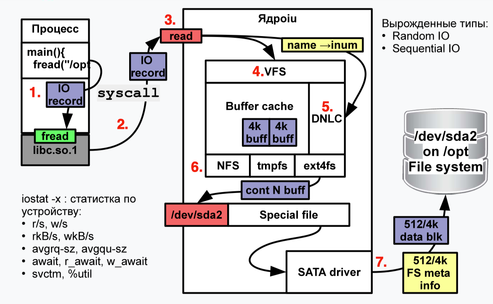

1. IO record - сколько байт нужно прочитать
2. Запрос к ядру (ссылка на запись с IO передается вместе с синхронным программным прерыванием) 
3. Вызов функции ядра **read** (точка доступа внутри ядра)
4. IO в ядре попадает в VFS (Virtual File System)
5. Имя файла преобразуется в DNLC - Directory Name Lookup Cache - кэш, ускоряющий обработку имен файлов
    - если директория содержит большое количество имен файлов, кэша не хватает —> система начинает тупить <—> ОС берет информацию с диска, а не с быстрой памяти
    - для экономии ресурсов ОС будет пользоваться в первую очередь буферным кэшем
6. Реализации модулей ядра физических файловых систем
    - Tmpfs — временное файловое хранилище во многих Unix-подобных ОС. Предназначена для монтирования файловой системы, но размещается в ОЗУ вместо физического диска.
7. К точке монтирования подключается устройство, далее работает драйвер
    
Полезная утилита `iostat`. Позволяет наблюдать:
- r/s, w/s - количество чтений и записей
- rkB/s, wkB/s - объем r/w данных
- avgrq-sz - среднее время запросов
- await, r_await, w_await - время ожидания
- svctm - время обслуживания
- %unil - загруженность диска

Процент занятости устройства - %used

Случайный (random IO) и последовательный (sequential IO) доступ. Первый - чтение из разных частей памяти накопителя. В случае с HDD из-за движения головки и диска теряет время на постановку в нужную точку, в отличии от SSD(движущиеся части отсутствуют). Последовательный доступ - чтения без трат на перестановку, за счёт чего скорость сводится лишь к пропускной способности чтения диска и передачи.
Узнать характеристику текущего обмена - iostat.


## 72. Мониторинг производительности: Windows и Linux.

Windows
    Task Manager - стандартное, встроенное решение
    Resource Monitor & Performance Monitor
    Reliability Monitor
    Microsoft SysInternals - наиболее точный инструмент, созданный независимо, но в последствии купленный M-soft


[В лекции](https://youtu.be/fGsgQFhidzk?t=5674)

[См конспект](lectures.md)

## 73. Системный анализ Linux "за 60 секунд".

- uptime - средняя нагрузка процессорной подсистемы (load average) в кол-ве готовых к выполнению процессов. За 1, 5 и 15 минут для получения динамики за длительный промежуток времени
- dmesg | tail - последние ошибки
- vmstat 1 - проверка виртуальной памяти
- mpstat -P ALL 1 - распределение процессов по CPU
- pidstat 1 - проверка наиболее “горячих” процессов
- iostat -xz 1 - характеристики ввода-вывода
- free -m - проверка исчерпания кэшей/буфферов
- sar -n DEV1 - сетевая статистика по интерфейсам
- sar -n TCP,ETCP 1 - сетевая статистика по соединениям
- top - онлайн-мониторинг параметров - “швейцарский нож” для администратора

## 74. Создание тестовой нагрузки и нагрузчики.

В корпоративных системах наблюдение реальных, критически важных для бизнеса систем часто запрещено из-за страха перед внесением искажений в нормальную работу системы средствами мониторинга, или перед наличием дефектов в средства. В таких случаях обычно создают отдельную тестовую систему, являющуюся полной копией реальной, и проводят измерения на ней.

Для тестовой системы нужно иметь возможность создавать нагрузку, близкую по характеристикам к реальной пользовательской нагрузке. В тестовой системе также возможно использование интрузивных средств мониторинга.

Нагрузку, аналогичную реальной, можно создать с помощью средства создания синтетической нагрузки или средства записи реальной нагрузки, позволяющего запомнить нагрузку на реальном устройстве и использовать эти данные для тестовой системы. При этом синтетическая нагрузка всегда будет отличаться от реальной, и в средствах создания такой нагрузки используется большое число параметров, позволяющих гибко её настроить.

## 75. Профилирование приложений. Основные подходы.

- Неинтрузивных профилировщиков **не бывает**

Профиоировщики нужны для анализа:
- Времени исполнения методов
- Создания объектов в памяти
- Потоков / блокировок

Два подхода:
- Внедрение в код напрямую
- Прерывания и дамп памяти с последующими сортировкой и анализом
    - получаем стек вызовов с определенным периодом
    - понимаем сколько примерно занимает исполнение разных методов
    - погрешность в рамках периода есть (если период больше времени отработки функции, ее можно не заметить)
    
## 76. Компромиссы (trade-offs) в производительности.

- Учите алгоритмы и структуры данных

## 77. Рецепты повышения производительности при высоком %SYS.


## 78. Рецепты повышения производительности при высоком %IO wait.


## 79. Рецепты повышения производительности при высоком %Idle.


## 80. Рецепты повышения производительности при высоком %User.

