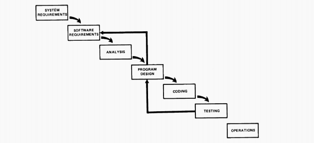
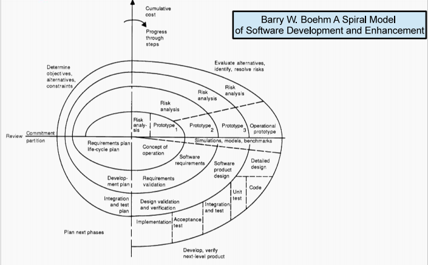
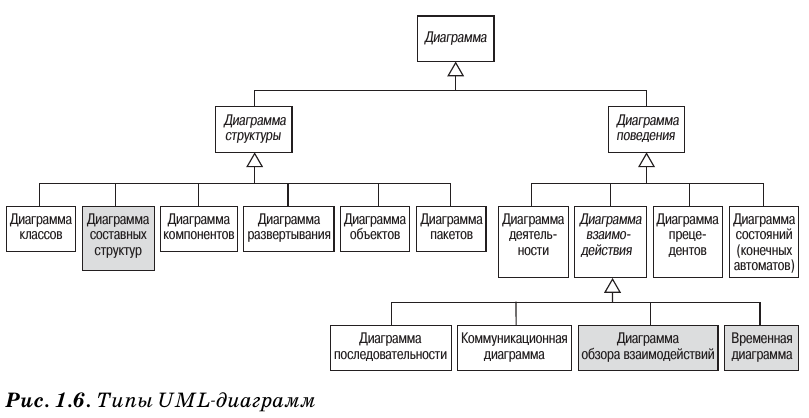
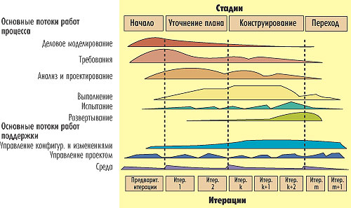
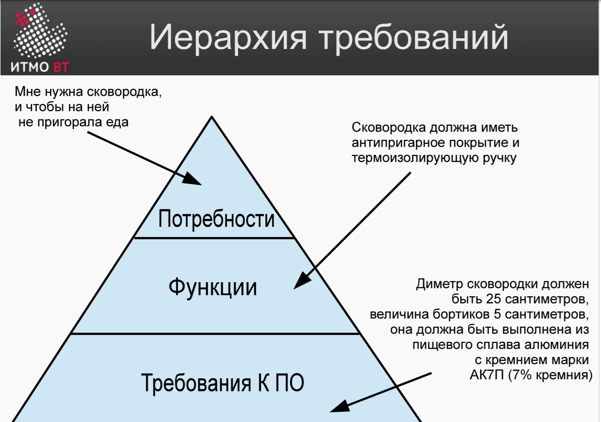
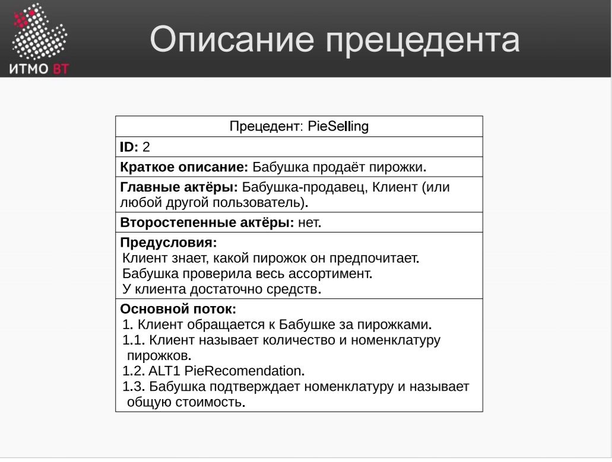

# Вопросы к экзамену МиСПИ 20/21

## 1. ISO/IEC 12207:2010: Жизненный цикл ПО. Группы процессов ЖЦ.

стр. 7

Жизненный цикл – время существования программы от момента замысла, 
до вывода ее из эксплуатации. Все этапы ЖЦ описаны в ISO 

Основные этапы:
- Разработка требований (формулирует заказчик)
- Анализ
- Проектирование
- Разработка и Тестирование
- Внедрение
- Эксплуатация (В процессе эксплуатации происходит поддержка пользователей)
- Вывод из эксплуатации

Группы процессов:
- Согласования (2)
- Орг. обоснования (5)
- Проектов (7)
- Тех. процессов (11)
- Реализация ПС (7)
- Поддержки ПС (8)
- Повторного использования ПС (3)

стр. 8

[wiki](https://ru.wikipedia.org/wiki/ISO/IEC_12207:2008)

## 2. Модели ЖЦ.

стр. 10


## 3. Водопадная (каскадная) модель.

стр. 12


Разработана в 60-х. Критически описана Ройсом в 70-х.

Каскадная модель определяет последовательный переход 
на следующий этап после завершения предыдущего. 
Для этой модели характерна автоматизация отдельных 
несвязанных задач. 

|Достоинства|Недостатки|
|:---|:---|
|Хорошие показатели по срокам разработки и надежности при решении отдельных задач| Неприменимость к большим и сложным проектам из-за невозможности принять изменения требований к системе в течение длительного проектирования|
| | Позднее тестирование|


## 4. Методология Ройса.

стр. 13

**Первый шаг**: 'Дизайн программы’. В нем дизайнеру предлагается спроектировать, определить и создать модели обработки данных и разработать документ: обзор будущей программы  

**Второй шаг**: документирование дизайна, требования к системе, спецификация дизайна, план тестирования, инструкция по использованию.

**Третий шаг**: 'do it twice', тестовая разработка параллельно основному процесса и использование в качестве пилота для подтверждения или опровержения основных спецификаций ПО

**Четвертый шаг**: планирование контроль и мониторинг 

**Пятый шаг**: подключения пользователя на ранних этапах


| Достоинства | Недостатки |
|:---|:---|
| Тестовая разработка параллельно основному процессу | |
| Подключение пользователей | |

## 5. Традиционная V-chart model J.Munson, B.Boehm.

стр. 14

Та же последовательность действий, что и в каскадной модели, 
но каждому уровню разработки свой уровень тестирования.

Модульное, интеграционное и системное тестирование проводятся 
последовательно на основании критериев верификации. Последним 
этапом является приемочное тестирование. Статическое тестирование 
может выполняться на ранней стадии разработки


|Достоинства|Недостатки|
|:---|:---|
| Тестирование ПО на каждой стадии ||

## 6. Многопроходная модель (Incremental model).

стр. 15

Цикл разделен на более мелкие легко создаваемые модули. Каждый модуль 
проходит через фазы определения требований, проектирования, кодирования, 
внедрения и тестирования. 

Процедура разработки по инкрементной модели предполагает выпуск на первом большом 
этапе продукта в базовой функциональности, а затем уже последовательное 
добавление новых функций, так называемых «инкрементов».

Процесс продолжается до тех пор, пока не будет создана полная система. 
Заказчик может наблюдать за разработкой, вносить изменения, 
которые не сильно увеличат стоимость.


|Достоинства|Недостатки|
|:---|:---|
| Изменения заказчика не намного увеличивают стоимость разработки. Модель закладывает не сложную доработку системы| Устаревание архитектуры системы |

## 7. Модель прототипирования (80-е).

стр. 16

Модель позволяет создать прототип программного продукта до или в течение 
этапа составления требований к программному продукту. 

Потенциальные пользователи работают с этим прототипом, определяя его сильные 
и слабые стороны, о результатах сообщают разработчикам программного продукта. 

Если прототип не подходит, то разработка начинается заново. 

Таким образом, обеспечивается обратная связь между 
пользователями и разработчиками, которая используется для изменения или корректировки спецификации требований к программному продукту


Жизненный цикл разработки программного продукта начинается с **разработки плана проекта**, 
затем выполняется **быстрый анализ**, после чего **создаются база данных**, 
**пользовательский интерфейс** и выполняется **разработка необходимых функций**. 

В результате этой работы получается документ, содержащий частичную 
спецификацию требований к программному продукту. После этого определяются 
проблемы, над устранением которых совместно работают пользователи и 
разработчики. Этот процесс продолжается, пока пользователи не станут довольны.


|Достоинства|Недостатки|
|:---|:---|
| Быстрая обратная связь ||
| Программный продукт точнее отвечает запросам пользователей ||

## 8. RAD методология. 80-е

стр. 18

**R**apid **A**pplication **D**evelopment model или быстрая разработка приложений

Разновидность _инкрементной модели_. Пользователь принимает 
непосредственное участие в процессе разработки.

При помощи интерфейса, пользователь способен создавать простейшие функции. 
В RAD-модели компоненты или функции разрабатываются несколькими 
высококвалифицированными командами параллельно, будто несколько мини-проектов.

Временные рамки одного цикла жестко **ограничены**.

Созданные модули затем интегрируются в один рабочий прототип. 
Синергия позволяет очень быстро предоставить клиенту для обозрения 
что-то рабочее с целью получения обратной связи и внесения изменений.


Модель быстрой разработки приложений включает следующие фазы:
- Бизнес-моделирование
- Моделирование данных
- Моделирование процесса
- Сборка приложения
- Тестирование

|Достоинства|Недостатки|
|:---|:---|
| Обратная связь от пользователей ||
| ||

## 9. Спиральная модель.

стр. 17

Спиральная модель = проектирование + постадийное прототипирование 

с целью сочетания преимуществ восходящей и нисходящей концепции. 
Данный подход может оказаться довольно затратным в применении. 

В спиральной модели особое внимание уделяется управлению рисками. 
Контроль рисков, в свою очередь, требует проведения специфического 
анализа на каждой итерации. Изменения – неотъемлемая часть разработки.



|Достоинства|Недостатки|
|:---|:---|
| Изменения – неотъемлемая часть разработки | Разработка может оказаться затратной|
| Особое внимание уделяется управлению рисками | Не подходит для маленьких проектов |

## 10. UML Диаграммы: Структурные и поведенческие.

Основное назначение UML - графическое представление различных аспектов
разработки ПО.


стр. 34 [UML 2]

### Структурные диаграммы 
Эти диаграммы используются для демонстрации статической структуры элементов 
в системе. Они могут изображать **архитектурную организацию системы**, **ее 
физические элементы**, **текущую конфигурацию**, а также **специфические элементы** 
предметной области.

### Поведенческие диаграммы

События, происходящие в системах программного обеспечения, 
являются динамическими: 
- объекты создаются и уничтожаются, 
- объекты передают сообщения другим объектам и системам, 
- внешние события активизируют операции над определенными объектами.  

## 11. UML: Use-case модель.
    
Это диаграмма динамического поведения в UML, которая моделирует 
функциональность системы с использованием участников, прецедентов и 
других важнейших объектов. 

Акторы (actors) — это люди или организации, которые 
работают под определенными ролями внутри системы. 

`Отношение включения` указывает на то, что поведение одного прецедента 
включается в некоторой точке в другой прецедент в качестве составного 
компонента. 

`Отношение расширения` отражает возможное присоединение одного 
варианта использования к другому в некоторой точке. 


стр. 33 [UML 2]

## 12. UML: Диаграмма классов.
    
[Почитать](https://flexberry.github.io/ru/fd_class-diagram.html)

Пример:


| Диаграмма | Классов |
|:---|:---|
| Содержит | объекты, которые взаимодействуют в рамках сценария |
|  | сообщения, которыми они обмениваются |
|  | возвращаемые результаты, связанные с сообщениями |
| Используется | для уточнения диаграмм прецедентов, более детального описания логики сценариев использования |
| Подходит | для документирования проекта (с точки зрения сценариев использования) |


## 13. UML: Диаграмма последовательностей (Sequence diagram)
    
[Почитать](https://flexberry.github.io/ru/fd_sequence-diagram.html)

Пример:


| Диаграмма | Последовательности |
|:---|:---|
| Содержит | объекты, которые взаимодействуют в рамках сценария |
|  | сообщения, которыми они обмениваются |
|  | возвращаемые результаты, связанные с сообщениями |
| Используется | для уточнения диаграмм прецедентов, более детального описания логики сценариев использования |
| Подходит | для документирования проекта (с точки зрения сценариев использования) |


- Объекты обозначаются прямоугольниками с подчеркнутыми именами (чтобы отличить их от классов).
- Сообщения (вызовы методов) - линиями со стрелками.
- Возвращаемые результаты - пунктирными линиями со стрелками.

## 14. UML: Диаграмма размещения (Deployment diagram)
    
[Почитать](https://flexberry.github.io/ru/fd_deployment-diagram.html)

В UML развертывание – это процесс распределения артефактов по узлам или экземпляров артефактов по экземплярам узлов. 

Пример:


| Диаграмма | Размещения |
|:---|:---|
| Содержит | графическое представление IT-инфраструктуры |
|  | топологию системы и распределение компонентов, их соединения |
| Используется | для аппаратно-программных систем |
| Подходит | для рационального распределения компонент |
|  | для решения вспомогательных задач (например: безопасность) |


## 15. *UP методологии (90-е). RUP: основы процесса.
    


## 16. RUP: Фаза «Начало».

стр. 22
    
Каждая фаза заканчивается вехой - переход на следующий этап.

Цели:
- Определение границ проекта
- Описание основных сценариев использования системы
- Разработка технологических решений
- Оценка рисков
- Подготовка окружения
- Расчет стоимости!

Веха Lifecycle Objects:
- Согласие сторон в оценке сроков, первоначальной стоимости, требованиях, приоритетах, технологиях
- Оценены риски и выбраны стратегии смягчения последствий 

| Фаза | Начало |
|:---|:---|
| Направление работ | Оценка проекта |
| Артефакт | Концепция ("Vision") |
| Веха | Lifecycle Objects |


## 17. RUP: Фаза «Проектирование» (уточнение).
    
стр. 23

**Исполняемая архитектура** — полностью законченные на базе выбранных технологий несколько характерных функций разрабатываемой системы.

Тестирование на этом этапе нужно для проверки основных **нефункциональных требований** (например пропускная способность)

- Документирование требований (включая детальное описание для большинства прецедентов).
- Сниженные основные риски.
  
Цели:
- Финализировать базовую архитектуру
- Разработать прототип
- Убедиться, что архитектура, планы и сроки стабильны, риски учтены
- Продемонстрировать, что архитектура подходит под требования

  Веха Lifecycle Architecture – веха стабильности
  
Веха Lifecycle Architecture:
- Концепция, требования, архитектура проекта стабильны?
- Сформированы критерии тестирования прототипов?
- Тестирование прототипов показало отсутствие основных рисков?
- Планы разработки подробны и приемлемы по цене?
- Решают вопрос с деньгами


| Фаза | Проектирование |
|:---|:---|
| Направление работ | Разработка и тестирование |
| Артефакт | Спроектированная, реализованная и оттестированная исполняемая архитектура, Экономическое соглашение |
| Веха | Lifecycle Architecture |

Заказчик может менять соглашение по деньгам.

## 18. RUP: Фаза «Построение».

В фазе «Построение» происходит реализация большей части функциональности продукта.

Фаза Построение завершается первым внешним релизом системы и вехой начальной функциональной готовности (Initial Operational Capability).

Цели:
- "Быстро, дешево, сердито"
- Итеративно и инкрементально провести анализ, проектирование, разработку и тестирование
- Подготовить продукт и пользователей

Фаза Initial Operational Capability:
- Достаточно ли стабилен релиз?
- Все стороны готовы к релизу для юзеров
- Все еще норм по деньгам?

| Фаза | Построение |
|:---|:---|
| Направление работ | Усиленная разработка |
| Артефакт | альфа- и бета-версии |
| Веха | Initial Operational Capability |

## 19. RUP: Фаза «Внедрение».

В фазе «Внедрение» создается финальная версия продукта и передается от разработчика к заказчику. 

Это включает в себя программу бета-тестирования, обучение пользователей, а также определение качества продукта. 

В случае, если качество не соответствует ожиданиям пользователей или критериям, установленным в фазе Начало, 
фаза Внедрение повторяется снова. Выполнение всех целей означает достижение вехи готового продукта (Product Release) 
и завершение полного цикла разработки.

Цели:
- Бета-тестирование
- Запуск маркетинга и продажи
- Отладка процессов устранения сбоев
- Открытый анализ соответствия ПО требованиям

Веха Product Release:
- Пользователи довольны?
- Че там с деньгами?

| Фаза | Внедрение |
|:---|:---|
| Направление работ | Тестирование качества, релиз |
| Артефакт | Релиз |
| Веха | Product Release |

## 20. Манифест Agile (2001).

Мир изменчив, бизнесу важно иметь возможность оперативно реагировать  
на изменчивый мир, внося правки (какая-то фича срочно нужна вчера).  
**RUP такой возможности не давал.**  

- **Люди и взаимодействия** важнее процессов и инструментов.  
- **Работающий продукт** важнее исчерпывающей документации.  
- **Сотрудничество с заказчиком** важнее согласования условия контракта.
- **Готовность к изменениям** важнее следования первоначальному плану.  
    не отрицая важности правого, мы больше ценим левое  

### 12 принципов AGILE:

- Удовлетворение требований заказчика
- Изменения требований приветствуются
- Частые выпуски программного продукта
- Ежедневная совместная работа
- Мотивированные профессионалы
- Непосредственное общение
- Работающий продукт -- показатель прогресса
- Постоянный ритм
- Техническое совершенство
- Простота
- Самоорганизующиеся команды
- Систематическая коррекция

## 21. Scrum.  

Скрам -- фактическая реализация принципов Agile.  


**Product owner** - знает, что нужно сделать и в какой последовательности.  
**Product backlog** - высокоуровневые требования к ПО, которые нужно реализовать.  
**Sprint backlog** - детализированный backlog на 1 спринт (1-4 недели).  
**Daily scrum** - daily meet up  
**Scrum master** - опытный парень, следит за процессом, помогает с декомпозицией
требований (product backlog -> sprint backlog)

## 22. Disciplined Agile 2.X (2013).  
Развитие Scrum привело к попытке совместить преимущества RUP со Scrum.  
Инкрементальная модель разработки опирается на модель спринтов.  
Подразумевается, что disciplined agile можно натянуть на большое-большое  
предприятие (в отличие от Scrum).  

**Взяв плюшки от RUP получаем масштабируемость**

  

## 23. Требования. Иерархия требований.  
- Требования -- условия или возможности, которым должна соответствовать система.  
- Требование -- подробное описание того, что должно быть реализовано.  
- Требование не описывает, как его необходимо реализовывать.  

Требования описываются в документе **Software Requirements Specification**(как на 1-ой лабе в отчете).  

Важно исключить разночтения требований, чтоб потом не попасть на бабос.  



## 24. Свойства и типы требований (FURPS+).  

- Корректность
- Однозначность
- Полнота
- Непротиворечивость
- Приоритизация
- Проверяемость
- Модифицируемость
- Отслеживаемость

FURPS — классификация требований к программным системам.
Образована от первых букв слов:

- Functionality — Функциональные требования: свойства, возможности, безопасность.  
  Являются основными, по этим требованиям строятся диаграммы вариантов использования (Use case diagram).
- Usability — Требования к удобству использования (UX): человеческий фактор, эстетика,  
  последовательность, документация.
- Reliability — Требования к надежности: частота возможных сбоев, отказоустойчивость,  
  восстанавливаемость, предсказуемость устойчивости.
- Performance — Требования к производительности: время отклика, использование ресурсов,  
  эффективность, мощность, масштабируемость.
- Supportability — Требования к поддержке: возможность поддержки, ремонтопригодность,  
  гибкость, модифицируемость, модульность, расширяемость, возможность локализации.


## 25. Формулирование требований. Функциональные требования.

{id}{система}должна/shall{требование}
- id -- уникальный идентификатор в системе контроля и изменения требований
- система -- имя системы или подсистемы.
- должен/shall -- юридически обязывающее словно.
- требование -- требование, которое должно быть исполнено.  

Функциональные требования определяют:  
- Feature sets -- наборы функциональных требований
- Capabilities -- возможности ПО
- Security - безопасность

## 26. Требования к удобству использования и надежности.  

Usability:
- Human factors -- учет особенностей пользователей (плохое зрение, слух).
- Aesthetics -- эстетические требования. (Толстый брендбук)
- Consistency in the user interface -- согласованность пользовательского интерфейса.
- Online and context-sensitive help -- требования к справочной подсистеме.
- Wizards and agents -- мастера (пошаговая штуковина) и ПО, повышающие продуктивность и простоту  
  работы пользователя.
- User documentation -- требования к пользовательской документации.
- Training materials -- требования к учебным материалам.


Reliability:
- Frequency and severity of failure -- частота и обработка отказов.
- Recoverability -- способность системы восстанавливать своё продуктивное состояние.
- Predictability -- предсказуемость поведения  
- Availability -- готовность системы к решению задач
- Accuracy -- точность
- MTBF -- среднее время между отказами
- Коэффициент готовности -- связь между средним временем между отказами  
и временем восстановления системы.

## 27. Требования к производительности и поддерживаемости.

Performance:
- Speed -- скорость решения задач
- Efficiency -- эффективность
- Throughput -- пропускная способность
- Response time -- время отклика 
- Recovery time -- время восстановления
- Resource usage -- использование системных (и других) ресурсов
  (все эти требования связаны и задаются сообща, а не по отдельности)

Supportability:
- Extensibility -- расширяемость
- Adaptability -- адаптируемость под конкретные задачи
- Maintainability -- поддерживаемость
- Compatibility -- совместимость
- Configurability -- способность задавать конкретную конфигурацию
- Serviceability -- возможность проведения профилактик и обслуживания
- Installability -- требования к установке на разные системы
- Localizability -- локализуемость для разных для разных языком и географических регионов

## 28. Атрибуты требований.

1. Приоритет -- MoSCoW
    - MUST have (Minimum Usable Subset) -- фундаментальные  
    для системы требования  
    - Should have -- важные
    - Could have -- потенциально возможные, улучшающие, к примеру пользовательское отношение
    - Won't have (Would like to have) -- мб в следующей версии  

2. Статус:  
    - предложенные, одобренные, отклоненные, включенные  
3. Трудоемкость:  
    - человеко-часы (чаще всего), функциональные точки,  
      use-case points, попугаи
4. Риск
5. Стабильность:  
    - высока, средняя, низкая
6. Целевая версия:  
    - когда включим в продукт?

## 29. Описание прецедента.  

Прецеденты(case) могут быть описаны в виде сценариев или,  
как, сейчас принято(модно) - user story.  

В дальнейшем разработчики зачастую анализируют ни сколько требования, сколько сценарии.

use-case description in RUP

## 30. Риски. Типы Рисков.
## 31. Управления рисками. Деятельности, связанные с оценкой.
## 32. Управления рисками. Деятельности, связанные контролем и управлением.
## 33. Изменение. Общая модель управления изменениями.
## 34. Системы контроля версий. Одновременная модификация файлов.
## 35. Subversion. Архитектура системы и репозиторий.
## 36. Subversion: Основной цикл разработчика. Команды.
## 37. Subversion: Конфликты. Слияние изменений.
## 38. GIT: Архитектура и команды.
## 39. GIT: Организация ветвей репозитория.
## 40. GIT: Плагин git-flow.


## 41. Системы автоматической сборки: предпосылки появления
1) Рутинный процесс сборки
2) Отличия архитектуры информационных систем
3) Медленная сборка

Если брать параллельные процессы компиляции, то возникает проблема доступа сборочных узлов к общим исходным 
кодам проекта

Вышеперечисленные причины и привели к появлению разнообразных систем сборки

## 42. Системы сборки: Make и Makefile.

Make - система сборки, появившаяся впервые в Unix-системах, существует и по сей день.

Является императивной(условно) системой сборки. Исходный код сборки располагается в Makefile, который
в свою очередь располагается в корневой директории проекта. Далее в корневой директории прописывается
команда "make" и происходит сборка проекта. По умолчанию основной направленностью maka являются "file targets". 
Чтобы сказать Make, что мы хотим работать не с файлами, а с наименованием цели, используем слово "PHONY".
Основная цель - all. Пример цели:
```
all:
    gcc -o main main.c
```   
## 43. Системы сборки: Ant. Команды Ant.
Apache Ant представляет собой императивную систему сборки, использующую в качестве основного файла build.xml.
Разрабатывалась для использования в Java-проектах. Файл состоит из target, в которых описана определенная
последовательность действий для достижения поставленной цели. Пример простого build.xml.
```xml
<project name="MyProject" default="dist" basedir=".">
  <property name="src" location="src"/>
  <property name="build" location="build"/>

  <target name="init">
    <mkdir dir="${build}"/>
  </target>

  <target name="compile" depends="init">
    <javac srcdir="${src}" destdir="${build}"/>
  </target>
</project> 
``` 


## 44. Системы сборки: Ant-ivy.
Apache Ivy - транзитивный менеджер пакетов, который использутся совместно с Apache Ant.
Пакет скачивает из Maven-репозитория(определение см ниже). Для конфигурации использует файлы 
ivysetting.xml и ivy.xml.

В головной build.xml подключиется при помощи:

```xml
<project name="MyProject" xmlns:ivy="antlib:org.apache.ivy.ant" default="dist" basedir=".">
    <target name="resolve">
        <ivy:retrieve/>
    </target>
```
Пример зависимости:

```xml
<ivy-module version="2.0">
<info organisation="org.apache" module="hello-ivy"/>
<dependencies>
    <dependency org="jakarta.annotation" name="jakarta.annotation-api" rev="1.3.5" />
</dependencies>
</ivy-module>
``` 


## 45. Системы сборки: Maven. POM. Репозитории и зависимости.
Apache Maven - одна из самых популярных систем сборки для Java-проектов на 
сегодняшний день. Использует декларативный подход. Основным файлом выступаем POM,
(Project Object Model)(основной файл - pom.xml)

```xml
<project xmlns="http://maven.apache.org/POM/4.0.0"    xmlns:xsi="http://www.w3.org/2001/XMLSchema-instance"  xsi:schemaLocation="http://maven.apache.org/POM/4.0.0   http://maven.apache.org/xsd/maven-4.0.0.xsd">    
  
  <modelVersion>4.0.0</modelVersion>  
  <groupId>com.javatpoint.application1</groupId>  
  <artifactId>my-app</artifactId>  
  <version>1</version> 
   
</project>  
```

В POM указываются имя, версия и тип программы, местоположение исходных кодов проекта
зависимости, плагины, альтернативные конфигурации проекта

Репозитории и зависимости.


## 46. Maven: Структура проекта. GAV.


В Maven существует система каталогов по умолчанию (src/main/java - исходные коды проекта)
(src/main/resources - дополнительные файлы проекта, .proprties файлы)

После работы готовые файлы кладутся в директорию target

GAV.

В Maven все зависимости описываются в GAV-синтаксисе, который представляет собой:
groupId:artifactId:version. Так описывается любая внешняя зависимость. Данные зависимости
скачиваются из интернета, поэтому если это не нужно, надо запретить в явном виде.

```xml
<project>
  <modelVersion>4.0.0</modelVersion>
  <groupId>com.mycompany.app</groupId>
  <artifactId>my-app</artifactId>
  <version>1</version>
</project>
```

## 47. Maven: Зависимости. Жизненный цикл сборки. Плагины.

Зависимости см пункт выше


## 48. Системы сборки: Maven. POM. Репозитории и зависимости.

СМ. 45-47

## 49. Системы сборки: GNU autotools. Создание конфигурации проекта.


## 50. Системы сборки: GNU autotools. Конфигурация и сборка проекта.

## 51. Сервера сборки/непрерывной интеграции.
## 52. Основные понятия тестирования. Цели тестирования.
## 53. Понятие полного тестового покрытия и его достижимости. Пример.
## 54. Статическое и динамическое тестирование.
## 55. Автоматизация тестов и ручное тестирование.
## 56. Источники данных для тестирования. Роли и деятельности в тестировании.
## 57. Понятие тестового случая и сценария.
## 58. Выбор тестового покрытия и количества тестов. Анализ эквивалентности.
## 59. Модульное тестирование. Junit 4.
## 60. Интеграционное тестирование. Стратегии интеграции.
## 61. Функциональное тестирование. Selenium.
## 62. Техники статического тестирования. Статический анализ кода.
## 63. Тестирование системы в целом. Системное тестирование. Тестирование производительности.
## 64. Тестирование системы в целом. Альфа- и бета-тестирование.
## 65. Аспекты быстродействия системы. Влияние средств измерения на результаты.
## 66. Ключевые характеристики производительности.
## 67. Нисходящий метод поиска узких мест.
## 68. Пирамида памяти и ее влияние на производительность.
## 69. Мониторинг производительности: процессы.
## 70. Мониторинг производительности: виртуальная память.
## 71. Мониторинг производительности: буферизированный файловый ввод-вывод.
## 72. Мониторинг производительности: Windows и Linux.
## 73. Системный анализ Linux "за 60 секунд".
## 74. Создание тестовой нагрузки и нагрузчики.
## 75. Профилирование приложений. Основные подходы.
## 76. Компромиссы (trade-offs) в производительности.
## 77. Рецепты повышения производительности при высоком %SYS.
## 78. Рецепты повышения производительности при высоком %IO wait.
## 79. Рецепты повышения производительности при высоком %Idle.
## 80. Рецепты повышения производительности при высоком %User.
