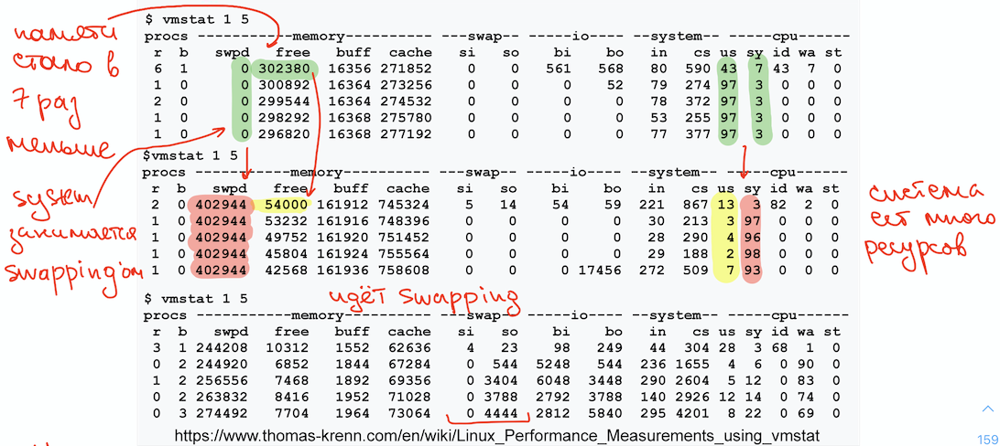
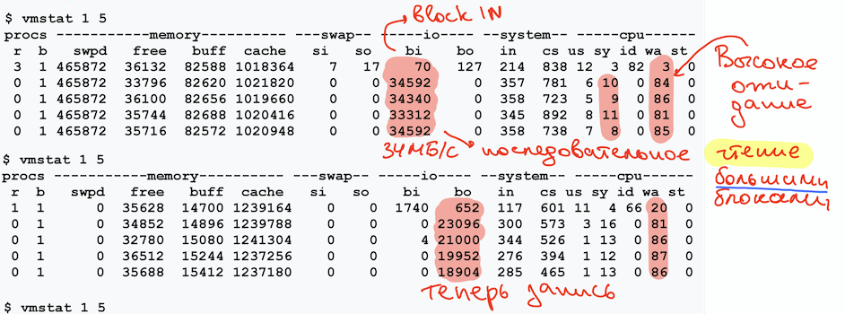
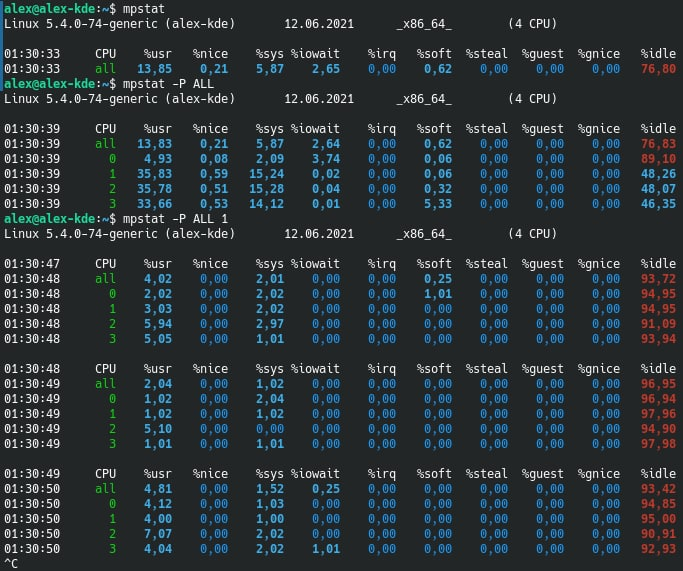
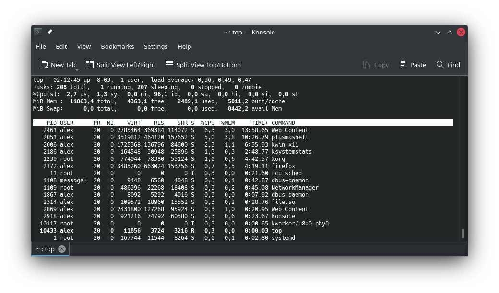
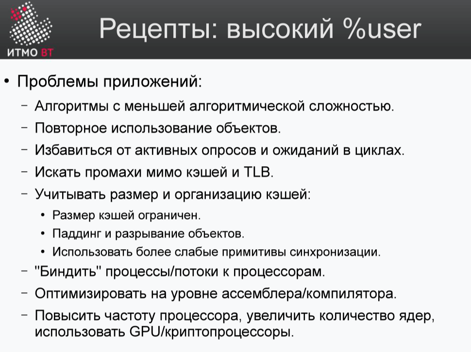
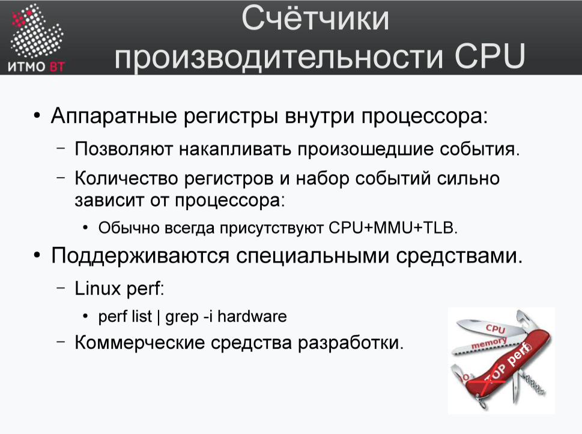

# [#1. Жизненный цикл ПО.](https://www.youtube.com/watch?v=wWea876rbBs&list=PLBWafxh1dFuykoWaAt7HiMOGgWXRvAN5V&index=1)

# [#2. RUP, UML и гибкие методологии разработки](https://www.youtube.com/watch?v=WQjJZyV4eNw&list=PLBWafxh1dFuykoWaAt7HiMOGgWXRvAN5V&index=2)

# [#3. Требования и риски](https://www.youtube.com/watch?v=CFMzn5dh1aE&list=PLBWafxh1dFuykoWaAt7HiMOGgWXRvAN5V&index=3)

# [#4. Управление изменениям, системы контроля версий](https://www.youtube.com/watch?v=-i5zCy0_EnA&list=PLBWafxh1dFuykoWaAt7HiMOGgWXRvAN5V&index=4)

стр. 66 Конспект

### `00:47` : Что такое изменение. Атрибуты изменений

Общая модель:
- Запрос и анализ
    - `Require new functionality [Customer]` / Encounter problem
    - `Technical feasibility[Project Manager]`: Необходимость и осуществимость изменений
        - Формирует документ / артефакт 
    - `Costs & benefits[Project Manager]`: Анализирует риски и выгоду для пользователя
        - Отражается в журнале изменения
- Подтверждение и реализация
    - `Analyze change impact`: Анализируется влияние на другие части системы и возможные последствия для пользователя
        - Появление артефакта
        - _Регрессионное тестирование_ - тестирование по максимально известным тестам, чтобы удостовериться, что новые фичи не мешают старым работать и не вносят новые баги в старый код или в новый код.
    - `Create planning`: Определение необходимых ресурсов, времени, графика осуществления действий.
        - Появление артефакта
    - `Realisation[Change builder]`: Непосредственно реализация изменения.
        - Создаются изменения `Items`
        - Внесение изменений в связанную документацию
        - Выпуск новой версии продукта
        - Артфакты: `Test report`, `Documentation`, `System Release`
  - Проверка и закрытие реализации
    - `Change verification[Project Manager]`: Утверждение изменений (иногда у заказчика) и формальное закрепление.
    

### `10:20` : Системы контроля версий

Основные типы VCS:
- На основе файловой системы
    - С экспортом клиентам
- Централизованные
    - Репозиторий на сервере
    - Самые распространенные
    - Пример: SVN
- Распределенные 
    - Репозиторий на каждом клиенте с центральным хранилищем на сервере
    - Пример: Git

### `15:25` : Почему появились VSC? Проблема одновременной модификации файлов

Причины:
- Необходимость журналирования изменений
- Командная работа

Одновременная модификация файлов:
- Lock-modify-unlock
    - В основном в VCS на файловой системе
    - Минус: Пока один человек меняет, все ждут
- Copy-modify-merge
    - Своя рабочая копия у каждого разработчика 
    - Минус: Трудности слияния рабочих копий
- Мгновенное отображение изменений невозможно (как Google Docs)
    - Срез проекта должен быть уникальным
    - Есть промежуточные стадии типа компилирования


### `19:25` : Subversion

стр. 73

Репозиторий (по SVN) - зафиксированная версия файлов на определенный момент времени (релиз/ревизия `r2342`)

`trunk` - основная ветвь разработки 

`branches` - хранение модификаций продукта
- Можно хранить отдельно релизы (значимые изменения), ветки для фичей, вендорные штуки

`tags` - функционально целостные изменения
- Минорные версии
- Исправление дефектов

Алгоритм работы с SVN:

Утро:
- `svn update` - обновление рабочей копии

Работа:
- `svn add/delete/copy/move/mkdir` - Изменения файлов
- `svn status` - Просмотр изменений
- `svn revert` - Откат изменений
  
Фиксация изменений:
- `svn update` - Загрузка изменений других разработчиков
  
Разрешение конфликтов
- `svn commit` - тут понятно


### `29:48` : Конфликты и слияния

стр. 77

Конфликты:
- Содержимого файлов
    - Изменения внутри файлов
- Структуры файлов
    - Перемешение, переименовани файлов
    

### `37:50` : Git

стр. 81

Главная идея Git - шарить коммиты. Распределенная VCS развивалась как VCS для разработки ядра Linux.
Разработчикам было удобно писать отдельные модули.
Но Git используется обычно по сценарию централизованной VCS.

### `47:55` : Ветвления в Git


### `56:00` : Удобная надстройка над Git - Git flow
- Идея: версионирование в терминах версий, а не операций

| |  Тип операции  | Команда | |
| :--- | :--- | :--- | :--- |
| |  `init`  | `start` | |
| | `feature` | `finish` | |
| `git flow` | `release` | `publish` | NAME |
| | `hotfix` | `pull` | |

`58:44` : SVN vs Git

[Статья "10 things I have about git"](https://stevebennett.me/2012/02/24/10-things-i-hate-about-git/)

# [#5 Системы автоматической сборки](https://www.youtube.com/watch?v=RFgqHUx7cgs&list=PLBWafxh1dFuykoWaAt7HiMOGgWXRvAN5V&index=5) 

### `00:00` : Мотивация. Предпосылки возникновения систем автоматической сборки

стр. 88

Причины появления:
- Скрипт сборки сложно поддерживать в актуальном состоянии с развитием проекта
- Сборка с учетом платформно-зависимых особенностей:
    - Разрядность 32/64:
        - Математические операции, определяющие разрядность
        - Слово памяти, определенное для передачи
        - Разрядность адреса на шине процессора
    - Размеры и организация кэшей
    - Разное размещение конфигурации:
        - Linux: обычно в `~/etc/`
        - Windows: в реестре `C:\Windows\System32\config\` (файлы `DEFAULT`, `SAM`, `SOFTWARE`, `SECURITY` и `SYSTEM`)
    - Стандарты POSIX
    - Необходимость создания для программ единого библиотечного окружения
- Медленная сборка 
    - Большое количество файлов для компиляции
        - Компиляция C++ кода с максимальной оптимизацией занимает много времени > ночные сборки
        - Было бы неплохо компилировать отдельные части проекта, а не каждый раз целиком
    - Не было параллелизма 

### `11:34` : Классические средства сборки Make (C) и Ant (java)

стр. 92

Средства автоматической сборки:
- Императивные
    - Задаем последовательность сборки файлов

Идея: вместо написания скриптов, напишем язык, который бы это дело автоматизировал

Особенности:
- Свои специальные языки
- Можно задать целевую систему для сборки
- Средства автоматического определения платформы
- _Декларативная сборка_ - не "как", а "что" вы хотите собрать
    - Более "мудрая" логика вокруг +- такого-же императивной сборки
- Интеграция с build-серверами
- Автотесты
- Распараллеливание (иногда многомашинный режим работы)

### `15:25` : Make и  Makefile

стр. 93

Исходные коды `.c`, `.h` —> Объектные файлы `.o` —> Бинарные файлы

Конфигурация определяется с помощью маркеров определения. 
В них задаются флаги, которые нужно выдать линковщику, компилятору...

[Makefile для самых маленьких. Habr](https://habr.com/ru/post/155201/)

Суть:
```
цель: зависимости
[tab] команда
```

Упрощенная структура makefile:

Блок переменных
```
CC=g++
CFLAGS= -c -Wall
```
Таргет
```
all: target-name
```
Описание сборки
```
target-name: main.o file1.o 

main.o: main.cpp
    $(CC) $(CFLAGS) main.cpp 

clean:
	rm -rf *.o hello
```
Супер крутой универсальный makefile:
```
CC=g++
CFLAGS=-c -Wall
LDFLAGS=
SOURCES=main.cpp hello.cpp factorial.cpp
OBJECTS=$(SOURCES:.cpp=.o)
EXECUTABLE=hello

all: $(SOURCES) $(EXECUTABLE)
	
$(EXECUTABLE): $(OBJECTS) 
	$(CC) $(LDFLAGS) $(OBJECTS) -o $@

.cpp.o:
	$(CC) $(CFLAGS) $< -o $@
```

### `19:53` : Ant - сборка java-программ

стр. 94

[Ant - быстрый старт. Habr](https://habr.com/ru/post/323204/)

[Видео автора статьи](https://www.youtube.com/watch?v=FHkzQooUw1Q)

[Хороший гайд для лабы с Ant](http://java-online.ru/blog-ant.xhtml)

- Императивная система сборки
- Управляется файлом build.xml

Пример build.xml:
```
<?xml version="1.0"?>
<project name="HelloWorld" default="run">
    <target name="compile">
        <mkdir dir="build/classes"/>
        <javac destdir="build/classes" includeantruntime="false">
            <src path="src"/>
        </javac>
    </target>
    <target name="run" depends="compile">
        <java classname="HelloWorld" classpath="build/classes"/>
    </target>
    <target name="clean">
        <delete dir="build"/>
    </target>
</project>
```
- Можно создавать переменные
```
<property name="build.dir" value="/tmp"/>
```
- Можно загружаться из файла
```
<property file="build.props" />
```
- Можно задавать переменное окружение
```
<property environment="env" />
<echo message="Shell path is ${env.PATH}" />
```

# TODO: расписать основные команды для защиты

Команды Ant делятся на:
- Для работы с файлами
- Компиляция
- Размещение на сервере
- Внешний запуск

В Ant так много команд для **кроссплатформенности**. 
В разных системах они могут иметь разную реализацию или вообще не существовать. 
Все, необходимое для сборки, уже реализовано внутри утилиты.

### `24:18` : Декларативная система Java-сборки `Maven`

- Детали сборки выносятся на знание плагинов. Плагины сами решают как им собираться
- Для сборки проекта используется `POM.xml` (Project Object Model):
    - Имя, версия, тип приложения
    - Местонахождение исходных кодов
    - Зависимости
    - Плагины - средства, используемые во время сборки
    - Профили - альтернативные конфигурации проекта
        - Разные целевые машины
        - Сборка с максимальной оптимизацией и тд
    
`26:20` : Центральный репозиторий - причина популярности Maven
- `mvn install`
- Читает `pom.xml`
- Скачка/обновление плагинов в локальный репозиторий
- Зависимости передаются Maven ядл компиляции

### `30:04` : Структура проекта для Maven

стр. 99

Декларативность накладывает определенные требования для структуры проекта.

`target` - рабочая и целевая директории

`src/main` - основные исходные файлы
- `src/main/java` - исходники .java
- `src/main/webapp` - исходники web-страниц, jsp, js, css
- `src/main/resources` - исходники, которые не нужно компилировать

`src/test` - исходники для тестов
- `src/test/java`
- `src/test/resources`
    
Naming-конвенция GAV - groupId:artefact:version
```=
<artifact>
  <groupId>org.example.group</groupId>
  <artifactId>example-artifact</artifactId>
  <version>1.2.0</version>
</artifact>
```

### `34:05` : Зависимости внутри Maven

стр. 101

Транзитивные = вложенные:
- GAV
- Scope: `compile`, `provided` (для серверов приложений), `test`, `runtime` - место в жизненном цикле компиляции, куда будет поставлена ваша зависимость
- Type: `jar`, `pom`, `war`, `ear`, `zip`...

### `34:08` : Жизненный цикл Maven

стр. 102

ЖЦ = Последовательность сборки нашего приложения (Maven)
- generate-sources/generate-resources
- compile
- test-compile
- test
- package
- integration-test (pre & post)
- install 
- deploy


### `40:01` : Плагины

- Все операции над проектом выполняются плагинами. Плагины выполняют императивные команды по сборке из наших хотелок в проект.
- Плагины в качестве точек входа содержат цели, связанные с ЖЦ:
    - Core: clean, deploy, compile, install, failsafe, resources, site, surefire
    - Packaging" jar, war, ear, rar ...
    - Reporting, Tools & 3rd-party
    

### `41:30` : Дальнейшее развитие Ant+Ivy, Gradle

Ivy - менеджер ависимоти для Ant. 
Ivy тянет все зависимости из Maven2.

Добавление в build.xml:
```xml
<project xmlns:ivy="antlib:org.apache.ivy.ant ... >"
    <target name="resolve">
        <ivy:retrieve>
    </target>
```
Зависимости можно задать в файле ivy.xml:
```xml
<dependencies>
    <dependency org="javax.servlet"
                name="servlet-api"
                rev="2.5" />
</dependencies>
```

### `43:43` : Чем не устраивает Ant и Maven? - XML

Чем хорош XML? 
- Легко проверяется корректность 
- можно осуществлять трансформацию во что-нибудь другое

### `46:46` : Вторая проблема Ant и Maven - проприетарность.

Они оба предназначены для сборки Java-проектов, а Gradle:
- Нейтрален к языкам программирования
- Базируется на Ant+Ivy (в слайдах опечатка)
- Использует те же зависимости от Maven + может использовать его репозитории
- Использует ЖЦ и плагины как Maven
- DSL (Domain Specific Language) на Groovy в качестве скрипта сборки
- Плагины существуют для большого количества проектов
- Инкрементальная и параллельная сборки (есть почти везде)

Пример build.gradle
```groovy
apply plugin: "java"
apply plugin "application"

mainClassName = "ru.ifmo.cs.Bcomp-NG"

repositories {
    mavenCentral()
}
dependencies {
    compile "log4j:log4j-core:2.12.1
}
jar {
    manifest.attributes("Main-Class": mainClassName);
}
```

[Почитать про Gradle](https://habr.com/ru/post/225189/)

### `50:40` : Платформо-зависимые системы сборки (вне Java)

- GNU autotools (C/C++), Cmake (C/C++), premake2 (lua)

Генерируются make-файлы на основании:
- Режимов работы программы
- Заданной конфигурации
- Операционной системы
- Фактического наличия библиотек

В чем отличие макроподстановки от компиляции программы с генерацией дерева?
Макроподстановка берет код и на заданных правилах меняет
одну последовательность символов на другую.

Пользователю нужно знать 3 команды: `./configure`, `make`, `sudo make install`

Тут неплохо бы было писать подробно процесс создания конфигурации проекта.
56 минут. я умираю


# [#6 Основы тестирования.](https://www.youtube.com/watch?v=_i2-oygZV7U&list=PLBWafxh1dFuykoWaAt7HiMOGgWXRvAN5V&index=6)

# [#7 Основы оптимизации производительности.](https://www.youtube.com/watch?v=fGsgQFhidzk&list=PLBWafxh1dFuykoWaAt7HiMOGgWXRvAN5V&index=7)

Кто занимается вопросами оптимизации?
- системный администратор:
    - с точки зрения операционной системы, деплоя приложения
    - смотрит сколько ресурсов занимают различные приложения внутри ОС
    - ОС имеет возможность регулировать выделяемые ресурсы
- опытный программист:
    - администратор занимается общим надсмотром за ПО и обычно просит программистов оптимизировать код, где он считает это нужно сделать
- **архитектор**:
    - смотрит на картину в целом
    - самая важная роль в оценке производительности
    
### `1:20` : от чего зависит скорость выполнения программы:

стр. 148

- Как система построена, как блоки системы между собой связаны (системный и архитектурный аспект)
- Характеристики самой машины (низкоуровневый аппаратный аспект)
- То, как программисты пишут код, оптимальность выбранных алгоритмов
- Человеческий фактор

Программисты постоянно балансируют между скоростью выполнения и памятью

### `7:46` - Влияние средств наблюдения на результаты. Как происходит анализ производительности. 

стр. 149

Анализ производительности - научный эксперимент.
- выбрать критерии оценки
- выбрать средства измерения
    - Неинтрузивные средства измерения = не влияют на результат
- выбрать нагрузку
    - стараться имитировать нагрузку, похожую на настоящую
    - это бывает сложная задача
- анализ результатов
- сделать небольшое изменение в системе, один участок кода
    - чтобы оттестировать именно то, что изменяли
- повторять до полного удовлетворения

### `14:36` - Основные характеристики и ключевые понятия

стр. 150

- Время отклика,
    - ожидание от воздействия на систему до получения первых данных 
- Время полного обслуживания 
    - от начала запроса до полного его завершения
- Пропускная способность
    - сколько запросов в единицу времени можно сделать
- Утилизация и ожидание ресурса 
- точка насыщения и масштабируемость
- Эффективность
    - 100% загруженность CPU не означает, что наша программа работает эффективно
- Ускорение и прирост производительности
    - что произошло после тестирования и улучшения производительности системы
- Java: Скорость запуска memory foorprint
    - связано с Garbage collector
    - то, как программа себя ведет внутри памяти
    - сервера приложений могут запускаться очень долго
    
### `17:55` - Поиск узких мест. Bottleneck

стр. 151

Классический "нисходящий" метод поиска узких мест:
- Исключение ошибок аппаратуры и администратора:
    - системные журналы, файлы конфигурации системы и прикладного ПО
- Общисистемный и межузловой мониторинг:
    - ОС сама собирает большое количество информации
    - Программисты обычно используют сторонние утилиты 
    - Если у вас кластер, для них есть отдельный набор своих утилит по мониторингу    
    - Анализируются: CPU, память, подсистема I/O, дисковые массивы, сеть, каналы передачи, ОС, виртуализация
- Мониторинг приложения: 
    - алгоритмы, проблемные API, многопоток, блокировки, синхронизации
    - сторонние прикладные API могут вредить производительности системы. Нужно четко понимать зачем нужна та или иная библиотека и какие накладные расходы она может дать. Можно она избыточная и проще будет написать какие-то модули руками
- Мониторинг микроархитектуры:
    - выравнивание данных — уверенность, что данные попадают в нужную строчку кэша
    - оптимизация кэшей
    - пузырьки конвейера
    - предсказание переходов

### `30:25` - Пирамида памяти
    
стр. 152


- CPU : самая быстрая и самая дорогая память 
- L1 : очень быстрая память. Находится максимально близко к ядрам процессора
- L2, L3 : тоже находятся внутри процессора.
- RAM : бОльшее время доступа, но и внушительный объем.
- SSD : Существенно медленнее оперативной памяти. Условно в 1000 раз медленнее
- HDD : Еще примерно в 1000 раз медленнее

* - масштаб времени относительно процессора

### `43:15` : Системный мониторинг производительности

стр. 153

- CPU : user%, system%, idle% (простой), прерывания, смена контекста (ctxt_sw), средняя нагрузка
- IO :  число байт читаемых и записываемых за секунду, и за какое количество операций это происходит; время ожидания
- VM :  (Виртуальная память) : скорость выделения, освобождения страниц, пейджинга, swap'инга
- Сеть : счетчики принятых/переданных данных, коллизий и тд

Системный мониторинг неинтрузивен (не оказывает влияния на производительность, так как счетчики автоматически включаются ОС.

### `47:00` - Диспетчер процессов CPU

стр. 154


Вне зависимости от того, что происходит в системе, происходит прерывание часов на каждом из ядер процессора.
При этом на ядре могут выполняться как пользовательские, так и системные задачи.
Таски строятся в приоритетную очередь, соответственно одни могут вытесняться другими. 

Принцип разделения времени:
- Процессам которые стоят в очереди дольше, ОС обычно повышает приоритет, чтобы увеличить шансы их скорого выполнения.
- Процессам, которые свой квант времени использовали, ОС понижает приоритет

preemption - вытеснение процесса с процессора (involuntary context swith - несвободное переключение контекста) - в общем случае это не есть хорошо, тк переключение контекста затратная операция

### `57:10`: Виртуальная память

стр. 155


**Виртуальная память** — способ защиты системы. Внутри VM приложение думает, что работает в одних и тех же адресах. Потом просто эта память маппится в реальную.

Можно использовать странички повторно, использовать 
- **paging** : сброс неиспользуемых страниц на диск или их уничтожение, 
- **совместное использование библиотек** : VM позволяет сделать так, чтобы одна страничка памяти была подключена к разным процессам, вместо создания копии для каждого
- **swapping** : процесс целиком уходит в область подкачки

### `1:09:27`: File buffered IO (буферизированный ввод/вывод)

стр. 156


1. IO record - сколько байт нужно прочитать
2. Запрос к ядру (ссылка на запись с IO передается вместе с синхронным программным прерыванием) 
3. Вызов функции ядра **read** (точка доступа внутри ядра)
4. IO в ядре попадает в VFS (Virtual File System)
5. Имя файла преобразуется в DNLC - Directory Name Lookup Cache - кэш, ускоряющий обработку имен файлов
    - если директория содержит большое количество имен файлов, кэша не хватает —> система начинает тупить <—> ОС берет информацию с диска, а не с быстрой памяти
    - для экономии ресурсов ОС будет пользоваться в первую очередь буферным кэшем
6. Реализации модулей ядра физических файловых систем
    - Tmpfs — временное файловое хранилище во многих Unix-подобных ОС. Предназначена для монтирования файловой системы, но размещается в ОЗУ вместо физического диска.
7. К точке монтирования подключается устройство, далее работает драйвер
    
Полезная утилита `iostat`. Позволяет наблюдать:
- r/s, w/s - количество чтений и записей
- rkB/s, wkB/s - объем r/w данных
- avgrq-sz - среднее время запросов
- await, r_await, w_await - время ожидания
- svctm - время обслуживания
- %unil - загруженность диска


### `1:16:22`: Мониторинг ОС. Средства мониторинга 

стр. 157

[Демо. Применение диагностики с поиском проблемы в системе](https://www.youtube.com/watch?v=rwVLa9me7e4)

Нагрузка на процессор (man mpstat):
```
CPU
     Processor number. The keyword all indicates that statistics are calculated as averages among all processors.

%usr
     Show the percentage of CPU utilization that occurred while executing at the user level (application).

%nice
     Show the percentage of CPU utilization that occurred while executing at the user level with nice priority.

%sys
     Show the percentage of CPU utilization that occurred while executing at the system level (kernel). Note that this does not include time spent servicing hardware  and
     software interrupts.

%iowait
     Show the percentage of time that the CPU or CPUs were idle during which the system had an outstanding disk I/O request.

%irq
     Show the percentage of time spent by the CPU or CPUs to service hardware interrupts.

%idle
     Show the percentage of time that the CPU or CPUs were idle and the system did not have an outstanding disk I/O request.
```
Утилиты мониторинга Linux:


Swapping:



Большие чтение/запись (близкие к пику производительности диска) ->
Последовательные чтение и запись:



Небольшое количество читаемых блоков + большой CPU WAit = Random IO скорее всего


### `1:34:33`: Системный анализ за 60 секунд

#### uptime
```
alex-iMac:~ alex$ uptime
 0:56  up 3 days, 14:15, 3 users, load averages: 2.27 2.61 2.56
 ```
Система почти не нагружена. Когда количество задач близко к количеству потоков, это хорошо. Если же сильно больше - нужно что-то с этим делать.
- `-p / --pretty` (нет на mac):
```
uptime -p
up 6 hours, 46 minutes
```

#### dmesg | tail - системные ошибки
```
sudo dmesg | tail
Password:

IOHIDLibUserClient:0x100029ea7 setValid: true
IOHIDLibUserClient:0x100029ea7 setStateForQueues: 0x0
IOHIDLibUserClient:0x100029ea4 setStateForQueues: 0x0
IOHIDLibUserClient:0x100029ea6 setValid: true
IOHIDLibUserClient:0x100029ea6 setStateForQueues: 0x0
```
#### vmstat 1 - есть ли свободная память, paging, распределение CPU
- нет на mac

```
procs -----------memory----------   ---swap-- -----io---- -system-- ------cpu-----
 r  b   swpd   free   buff   cache    si   so    bi    bo   in   cs us sy id wa st
 0  0      0 4693176 398056 4714400    0    0   325   127  955 2439 17  8 72  3  0
 0  0      0 4689380 398056 4718312    0    0     0     0  795 2095  4  2 94  0  0
 0  0      0 4689268 398056 4718248    0    0     0     0  860 2658  6  3 92  0  0
 0  0      0 4691420 398056 4718012    0    0     0     0  723 1829  3  2 96  0  0
 ...
```
#### mpstat -P ALL 1
- нет на мак
- `-P ALL` отвечает за вывод нагрузки по ядрам
- `1` в конце отвечает за интервал между снятиями показаний




#### pidstat 1 - проверка наиболее “горячих” процессов

#### iostat -xz 1 - характеристики ввода-вывода
- `-x`: Display extended statistics
- `-z`: Tell iostat to omit output for any devices for which there was no activity during the sample period.
- `1`: раз в секунуду
- если %util > 60 это плохо (не всегда правда для SSD)


На вторую секунду неактивные строчки уже не выводились.


#### free -m - проверка исчерпания кэшей/буфферов

Опции:
```
-b, --bytes
      Display the amount of memory in bytes.

-k, --kibi
      Display the amount of memory in kibibytes.  This is the default.

-m, --mebi
      Display the amount of memory in mebibytes.

-g, --gibi
      Display the amount of memory in gibibytes.

--tebi Display the amount of memory in tebibytes.

...

--mega Display the amount of memory in megabytes. Implies --si.

--giga Display the amount of memory in gigabytes. Implies --si.
```

Пример вывода:

```
alex@alex-kde:~$ free -m
              total        used        free      shared  buff/cache   available
Mem:          11863        2366        4489         625        5006        8559
Swap:             0           0           0
```

#### sar -n DEV 1 - сетевая статистика по интерфейсам 
- System Activity Reporter

#### sar -n TCP/ETCP 1 - сетевая статистика по соединениям

#### top - онлайн-мониторинг параметров - “швейцарский нож” для администратора


Модифицированная версия (htop):


От себя добавлю: `netstat` - полезная утилита для работы с сетью. ([Видео](https://www.youtube.com/watch?v=bxFwpm4IobU))

Некоторые полезные ключи:
- `-ie`: = `ifconfig` - все те
- `-r`: routing table
- `-c`: continuous - вывод всех активных соединений во времени
- `-p`: добавить колонку процесса, к которому привязано соединение
- `-l`: показать соединения со стейтом LISTENING
- `-a`: показать все сокеты
    - `-t`: выбрать только соединения с протоколом tcp (можно комбинировать с `-a` и `-l`)
    - `-u`: то же для upd (updt не имеет state кстати)
Пример вывода `netstat -a`:

```
netstat -a
Active Internet connections (including servers)
Proto Recv-Q Send-Q  Local Address          Foreign Address        (state)    
tcp4       0      0  192.168.1.38.53781     webim.ru.https         ESTABLISHED
tcp4       0      0  192.168.1.38.53780     253.34.228.35.bc.https ESTABLISHED -> скорее всего относится к браузеру (ждет https)
tcp6       0      0  joeykes-imac.blackjack fe80::e25b:3d9f:.15755 ESTABLISHED
tcp46      0      0  *.wbem-exp-https       *.*                    LISTEN -> 
tcp4       0      0  localhost.6942         *.*                    LISTEN     
tcp4       0      0  192.168.1.38.55880     51.103.5.159.https     CLOSE_WAIT 
tcp4       0      0  192.168.1.38.53103     hbrt-or1-ext-vip.https CLOSE_WAIT
udp46      0      0  *.mdns                 *.* 
udp4       0      0  *.*                    *.*                               
udp6       0      0  localhost.51323        localhost.51323  


Active Multipath Internet connections
Proto/ID  Flags      Local Address          Foreign Address        (state)    
icm6       0      0  *.*                    *.*                               
Active LOCAL (UNIX) domain sockets
Address          Type   Recv-Q Send-Q            Inode             Conn             Refs          Nextref Addr
41caefc55432b4bb stream      0      0                0 41caefc554328f3b                0                0 /var/run/mDNSResponder
41caefc55432b32b stream      0      0                0 41caefc55432b19b                0                0
41caefc554329003 stream      0      0                0 41caefc55432ab5b                0                0 /var/run/mDNSResponder
41caefc554329e13 stream      0      0 41caefc529a7e98b                0                0                0 /var/folders/4k/j7hl1hg501l_czt5pf8qr6b40000gn/T/.com.hnc.Discord.9V8a7E/SS
41caefc554329c83 stream      0      0 41caefc52525858b                0                0                0 /tmp/Sublime Text.4cff18d2bab96a93366319a9e0fa060d.d9672b715d018f64bb9a8e94257a7c57.sock
41caefc517989c1b stream      0      0 41caefc52f1afb8b                0                0                0 /var/folders/4k/j7hl1hg501l_czt5pf8qr6b40000gn/T/.com.google.Chrome.cvQBXe/SingletonSocket
41caefc51798b133 stream      0      0 41caefc51eb4168b                0                0                0 /private/var/run/.sim_diagnosticd_socket
41caefc52841d003 dgram       0      0                0 41caefc51798ae13                0 41caefc52841cc1b
41caefc52841cc1b dgram       0      0                0 41caefc51798ae13                0 41caefc52841e38b
41caefc52841f32b dgram       0      0                0 41caefc52841ca8b 41caefc52841ca8b                0
41caefc52841ca8b dgram       0      0                0 41caefc52841f32b 41caefc52841f32b                0
41caefc52841e38b dgram       0      0                0 41caefc51798ae13                0 41caefc52841cf3b
41caefc52841cf3b dgram       0      0                0 41caefc51798ae13                0 41caefc52841f4bb
...

Registered kernel control modules
id       flags    pcbcount rcvbuf   sndbuf   name 
       1        9        0   131072   131072 com.apple.flow-divert 
       2        1        0    16384     2048 com.apple.nke.sockwall 
       3        9        0   524288   524288 com.apple.content-filter 
       4        1       13    65536    65536 com.apple.net.netagent 
       5        9        8   524288   524288 com.apple.net.utun_control 
       6        1        0    65536    65536 com.apple.net.ipsec_control 
       7        0       60     8192     2048 com.apple.netsrc 
       8       18        3     8192     2048 com.apple.network.statistics 
       9        5        0     8192    32768 com.apple.network.tcp_ccdebug 
       a        1        0     8192     2048 com.apple.network.advisory 
       b        0        1     8192     8192 com.apple.fileutil.kext.stateful.ctl 
       c        0        3     8192     2048 com.apple.fileutil.kext.stateless.ctl 
...
       
Active kernel event sockets
Proto Recv-Q Send-Q vendor  class subcla
kevt       0      0      1      4      0
kevt       0      0      1      1     11
kevt       0      0      1      1      7
kevt       0      0      1      6      1
...


Active kernel control sockets
Proto Recv-Q Send-Q   unit     id name
kctl       0      0      1      4 com.apple.net.netagent
kctl       0      0      2      4 com.apple.net.netagent
kctl       0      0      7      5 com.apple.net.utun_control
kctl       0      0      8      5 com.apple.net.utun_control
kctl       0      0      9      7 com.apple.netsrc
kctl       0      0     10      7 com.apple.netsrc
...

```

Пример `netstat -atp`:

```
alex@alex-kde:~$ netstat -atp
(Not all processes could be identified, non-owned process info
 will not be shown, you would have to be root to see it all.)
Active Internet connections (servers and established)
Proto Recv-Q Send-Q Local Address           Foreign Address         State       PID/Program name    
tcp        0      0 localhost:5939          0.0.0.0:*               LISTEN      -                   
tcp        0      0 localhost:domain        0.0.0.0:*               LISTEN      -                   
tcp        0      0 localhost:ipp           0.0.0.0:*               LISTEN      -                   
tcp        0      0 alex-kde:35728          ec2-35-167-253-19:https ESTABLISHED 2172/firefox        
tcp        0      0 alex-kde:59044          149.154.167.50:https    ESTABLISHED 3002/telegram-deskt 
tcp        1      0 alex-kde:41040          server-13-33-242-:https CLOSE_WAIT  2675/plasma-browser 
tcp        0      0 alex-kde:38272          srv129-129-240-87:https ESTABLISHED 2172/firefox           
tcp        0      0 alex-kde:54796          srv194-139-240-87:https TIME_WAIT   -                   
tcp        0      0 alex-kde:39444          142.251.1.94:https      ESTABLISHED 2172/firefox        
tcp        1      0 alex-kde:43376          srv67-190-240-87.:https CLOSE_WAIT  2675/plasma-browser 
tcp        0      0 alex-kde:43988          ec2-34-214-1-68.u:https ESTABLISHED 2172/firefox         
tcp        0      0 alex-kde:59084          149.154.167.50:https    ESTABLISHED 3002/telegram-deskt 
tcp        0      0 alex-kde:54804          srv194-139-240-87:https ESTABLISHED 2172/firefox        
tcp6       0      0 [::]:1716               [::]:*                  LISTEN      2082/kdeconnectd    
tcp6       0      0 localhost:ipp           [::]:*                  LISTEN      -
```

Жизненный пример: посмотреть что там с SSH:


# TODO: добавить про [perf](https://www.youtube.com/watch?v=M6ldFtwWup0&list=PLx-WakpEO8zFQGRrB4xYAuWjHKqVWlwaD) что-нибудь

[Хабр. Красивая книжечка. Введение в perf](https://habr.com/ru/company/first/blog/442738/)

[Perf + flamegraph](https://habr.com/ru/company/selectel/blog/437808/)
### `1:37:53`: Создание тестовой системы и нагрузчики

- Утилита `dd`

В корпоративных системах наблюдение реальных, критически важных для бизнеса систем часто запрещено из-за страха перед внесением искажений в нормальную работу системы средствами мониторинга, или перед наличием дефектов в средства. В таких случаях обычно создают отдельную тестовую систему, являющуюся полной копией реальной, и проводят измерения на ней.

Для тестовой системы нужно иметь возможность создавать нагрузку, близкую по характеристикам к реальной пользовательской нагрузке. В тестовой системе также возможно использование интрузивных средств мониторинга.

Нагрузку, аналогичную реальной, можно создать с помощью средства создания синтетической нагрузки или средства записи реальной нагрузки, позволяющего запомнить нагрузку на реальном устройстве и использовать эти данные для тестовой системы. При этом синтетическая нагрузка всегда будет отличаться от реальной, и в средствах создания такой нагрузки используется большое число параметров, позволяющих гибко её настроить.

### `1:42:17`: Профилирование приложений

- Неинтрузивных профилировщиков **не бывает**

Профиоировщики нужны для анализа:
- Времени исполнения методов
- Создания объектов в памяти
- Потоков / блокировок

Два подхода:
- Внедрение в код напрямую
- Прерывания и дамп памяти с последующими сортировкой и анализом
    - получаем стек вызовов с определенным периодом
    - понимаем сколько примерно занимает исполнение разных методов
    - погрешность в рамках периода есть (если период больше времени отработки функции, ее можно не заметить)

### `1:50:24`: Trade-offs, алгоритмы, архитектура ПО

- Учите алгоритмы и структуры данных

### `1:52:20`: Рецепты повышения производительности


`1:59:18`


`2:02:12`

Запустили программу, user = 0, sys = 0, idle -> 100.

Обычно неэффективно используются блокировки

Программа не может использовать ресурсы компьютера


`2:05:36`



3. spinloop
4. кэш работает неэффективно. 2% промахов снижают производительность на 40%
5. 3. valotile/atomic вместо lock
6. Биндить плохо потому что программа будет заточена под конкретную систему
    - Биндить хорошо потому что процессор будет обращаться только к своему кэшу, не ходя в далекую память (для сногопроцессорной системы. Архитектура Нума)
    
### `2:16:30`: Счетчики производительности CPU


